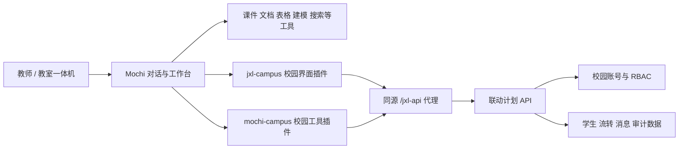

# Mochi 演变过程与“联动计划”关系

> **status**: active
> **last_verified**: 2026-09-13
> **verified_by**: Codex（Mochi Git 历史、当前源码、配置、工作日志及“联动计划”现有说明）

## 两个项目分别负责什么

### Mochi

Mochi 是教师侧 AI Agent 和桌面工作空间，负责：

- 对话、任务理解、工具调用和 Agent 预设；
- 本地工作区、文件权限与成品打开；
- 课件、文档、表格、视觉、建模、知识库、搜索和记忆；
- A2A 调度、局域网协作和定时任务；
- 把校园界面和校园业务工具接入同一个工作台；
- Electron 桌面打包、教师角色和教室一体机角色。

### 联动计划

“联动计划”是独立的校园学生跨区域协同与安全闭环平台，负责：

- 校园账号、角色权限和会话；
- 学生、班级、宿舍、医务、放行、到达、返班和消息等业务数据；
- 校园网页、PWA 和微信小程序；
- 审计日志、通知、数据库和后台定时任务；
- CloudBase 主部署与 Cloudflare 回退方案。

它当前位于 Mochi 同级目录 `/Users/a1379/Documents/联动计划`，有独立 Git、依赖、部署配置和文档。Mochi 不应把它合并成自己的源码子目录，也不应把 `campus.nosync` 当成它的最新版本。

## 二者如何连接

连接分为三层：

1. **界面层**：`client-plugins/jxl-campus` 在 Mochi 侧栏提供校园工作入口，加载“联动计划”构建出的静态客户端。
2. **工具层**：`plugins/mochi-campus` 把查询、协作和受控业务动作暴露给 Mochi Agent。
3. **服务层**：`/jxl-api` 把请求代理到 `MOCHI_CAMPUS_API_URL` 指定的校园 API；校园系统继续负责认证、权限和业务状态。

校园账号登录与模型 API 凭据互不等价。Mochi 能调用模型不代表已经登录校园系统；登录校园系统也不会自动放开模型或本地文件权限。

## 开发、运行和打包时的来源

### 开发态

校园源码解析顺序已经写入 `scripts/campus-paths.cjs`：

1. `MOCHI_CAMPUS_SOURCE_ROOT` 显式指定且必须有效；
2. Mochi 同级目录 `../联动计划`；
3. 旧兼容副本 `campus.nosync`。

当前本机解析到第二项“联动计划”。如果显式路径无效，解析器会报错，不会静默落回旧副本。

### 运行态

- `MOCHI_CAMPUS_API_URL` 决定真实校园 API Origin。
- `MOCHI_CAMPUS_STATIC_ROOT` 可以显式指定已构建的校园静态客户端。
- `MOCHI_CAMPUS_STATE_DIR` 只用于本地开发状态；生产包不应携带本地数据库或个人会话。
- `runtime-profile.json` 的 `serviceDefaults.campusApiUrl` 已版本化为 `https://jyl-campus-health-entry.pages.dev`；打包版据此直连生产后端，不再回落到本机回环。

`mochi-dev-up.sh` 的 `cloud` 默认指向 `https://jyl-campus-health-entry.pages.dev`，与随包值一致（2026-09-18 实测 `/api/health` 返回 200，`service` 为“嘉行联 Worker”）。只在需要指到别的上游时才显式设置 `MOCHI_CAMPUS_API_URL` 或 `MOCHI_CAMPUS_MODE`。

### 打包态

桌面包只复用“联动计划”执行 `pnpm run build:mochi` 后产生的 `mochi-dist/client` 静态客户端。发布准备脚本会记录来源提交和 dirty 状态，并拒绝缺少 `embed.js`、样式或品牌资源的输入。

桌面包不复制以下内容：

- “联动计划”源码仓库；
- Worker / 云函数服务端代码；
- D1 或 PostgreSQL 数据；
- `.dev.vars`、用户凭据和校园会话；
- 源项目的 `node_modules`。

因此，安装 Mochi 并不等于部署校园后端。Mochi 可以带校园前端界面，真实查询和操作仍依赖一个可用且配置正确的校园 API。

## A2A 和校园 Relay 的关系

Mochi 自己维护 A2A 任务域、状态机和局域网投递；“联动计划”维护校园 Relay 和业务消息。两者通过兼容映射衔接：Mochi 的 `DELIVERED / COMPLETED / DECLINED` 对应 Relay 的 `pending / accepted / declined`。

同一校园网内，Mochi 可以使用局域网通道连接教师端与教室端；校园 Relay 用于跨角色和服务端持久化。局域网身份不从模型参数或校园账号推导，校园写操作也不会因为 A2A 投递成功而跳过人工授权。

## 项目演变

| 日期 | 已确认节点 | 依据与含义 |
|---|---|---|
| 2026-08-31 前后 | “联动计划”已经形成独立校园 Web、数据库、角色权限和 CloudBase 部署路线 | 其部署文档和项目说明；Mochi 尚未在本仓库建立首个提交 |
| 2026-09-04 | Mochi 建立 Electron + Vite + React 19 骨架，ExpressiveOrb 首次运行 | Git 首次提交 `b647763` |
| 2026-09-04 至 09-05 | Mochi 从桌面壳演变为品牌化 Agent 工作台；接入校园静态界面、侧栏入口和 `mochi-campus` 工具 | `WORKLOG.md`、现存 `jxl-brand`、`jxl-theme`、`jxl-campus` 与校园插件 |
| 2026-09-05 | 校园全站嵌入调整为更适合 Mochi 的小组件和工具接入；形成查找、流转、消息与 A2A/Relay 协作 | 工作日志、A2A 时点报告与现行插件 |
| 2026-09-06 至 09-08 | 记忆、文档、课件、表格、视觉、模型、附件等能力逐步进入插件化架构；桌面打包和资源闭包开始收敛 | 2026-09-08 基线提交 `e568c16` 及历史工单 |
| 2026-09-09 至 09-11 | 教师工作流、课堂角色、知识库、搜索、局域网、医生检查和安装流程继续补齐 | `docs/tasks/`、`WORKLOG.md` 与当前源码；工单状态只代表当时范围 |
| 2026-09-12 | 快照、依赖和打包门禁收口；Windows 原生 CI 首次实际产出安装包 | Git 提交 `9f549da` 及发布记录 |
| 2026-09-13 | 默认模型种子切到 `mochi-aiaaa/deepseek-v4.1-flash`，Mac 双架构包和 Windows run #33 产物落盘 | Git 提交 `fd211b1`、`b0431a9`、`e3be3d1` 与磁盘文件 |
| 2026-09-13 | 宣传片迭代到 V6；随后把多套旧方案和交接页收口为现行文档体系 | `promo/` 版本记录与本次文档整理 |

## 从最初设想到当前形态的关键变化

1. **从桌面外壳到可执行 Agent**：早期重点是 Electron、品牌和界面；当前重点已经转为工具执行、真实产物和教师工作流。
2. **从复制校园系统到连接独立系统**：早期曾使用 `campus.nosync` 和全站嵌入；当前以同级“联动计划”为规范源码，只把静态客户端和 API 接口接入 Mochi。
3. **从单一助手到多 Agent 协作**：课件、资料、校园和教室端通过 A2A、Relay 与局域网形成任务链。
4. **从设计文档驱动到源码与门禁驱动**：版本、插件、打包输入和交付状态改由源码、快照和检查脚本确认；旧计划降为历史。
5. **从功能罗列到参赛故事线**：提交材料和宣传片强调真实输入、执行过程、成品、校园连接和权限闭环。

## 当前仍需处理的关系问题

- 用户指出“联动计划”的服务器报告有问题；这不等于 Mochi 插件失效，也不能据此推断线上服务正常。
- “联动计划”文档记录了 CloudBase 已部署结果，但本轮没有执行在线探测；提交前应在该项目单独复核。
- Mochi 开发脚本的 Cloudflare 默认地址与“联动计划”的 CloudBase 主路线不一致，长期应改为显式配置或受管环境配置，避免双重口径。
- 两个项目应分别提交和发布：先固定“联动计划”的构建提交及 API Origin，再生成 Mochi 的校园静态输入和桌面包。
