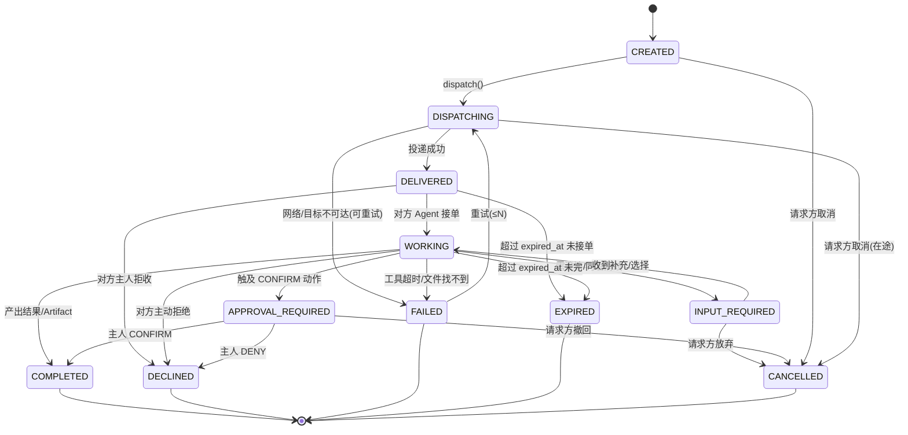

# Mochi Dispatch Protocol v1（MDP-v1）— 协议层设计

> 作者定位：协议层架构师。工具层由另一 Agent 并行设计，本文**不触碰工具内部实现**，只定义 Agent 之间的协作协议、数据模型、状态机、安全边界与 API Contract。
> 已读事实依据见文末「依据清单」。本文所有结论均为**已定决策**，不做开放式建议。

---

## 0. 设计边界与硬约束（先锁死）

1. **嘉行联目录只读**：`/Users/a1379/Documents/联动计划/` 一个字不改。其 `mochi_relay_messages` / `mochi_resources` / 工具 `MOCHI_RELAY_ASK` `MOCHI_RELAY_STATUS` `MOCHI_RESOURCE_FIND` `MOCHI_RESOURCE_REGISTER` 全部视为**既成事实的遗产传输层**，MDP-v1 在其上做向上抽象，不推翻。
2. **已跑通的 Relay 不能推翻**：现有用户间传话（pending/accepted/declined + body + reply + 二期 kind=request/item）继续工作。MDP-v1 新增 `mochi_tasks` 等表为**新规范存储**，并通过「归一化桥」复用遗产 Relay 作为只读显示源。
3. **A2A 必须有人参与**：对方主人要批准。这与 dsh `acp/` 的 "automation-only, no human in the loop" 定位冲突——因此 A2A **不包装** subagent，见 §6。
4. **请求方永远不能直接访问对方文件系统**：只能通过 Task → 对方 Agent 自己查找 → Artifact Grant 返回。架构层强制（§4）。
5. **LLM 永远看不到密码 / Session Secret / Refresh Token**：见 §5。
6. **26 天比赛约束**：五 Demo 必须跑通；第一版只锁 ASK / REQUEST / FIND / APPROVE 四原语 + 四个基础机制。

---

## 1. Agent Capability Registry（能力注册表）

> 🔴 **修订记录（设计修订官 / P0-1，裁决 R2）**：原稿整份协议依赖一个"Mochi 协调服务器"（`mochi_agents`/`mochi_tasks`/`mochi_artifacts`/`mochi_artifact_grants` 表 + `/api/mochi/v1/*`），但 01/03 的运行时是纯本地桌面 dsh app，**没有任何一项工时在建造这台服务器**（见 04_REVIEW P0-1）。裁决：**v1 不建独立协调服务器，改为单机模拟**——"另一个 Mochi / Resource Agent"用本地第二个 dsh profile 或进程内 mock 扮演；human approval 由桌面 APP 的 answerer 渲染确认卡（不走 `subagent-acp`，因其 automation-only 无人在环）。下方所有 `mochi_*` 表与 `/api/mochi/v1/*` 端点**仅作为"数据模型规范"保留**，v1 由本地 mock 实现闭环，不接真实后端、不起服务器。真跨网络 A2A 留答辩"下一步"。

### 1.1 表结构（D1/SQLite 方言，v1 仅作规范）

```sql
-- 0026_mochi_agents_registry.sql
CREATE TABLE IF NOT EXISTS mochi_agents (
  agent_id TEXT PRIMARY KEY,                 -- 全局唯一，形如 org:dept:role:ownerId
  owner_type TEXT NOT NULL
    CHECK(owner_type IN ('TEACHER','STUDENT','NURSE','ADMIN','DORM_STAFF','IT','PARENT')),
  owner_id INTEGER NOT NULL,                 -- 对应嘉行联 users.id（只读引用，不强制外键）
  organization TEXT NOT NULL,               -- 学校/集团标识，如 'jiaxiang'
  department TEXT NOT NULL DEFAULT '',      -- 年级组/科室/部门
  role TEXT NOT NULL,                        -- 角色标签，供展示与粗筛
  availability TEXT NOT NULL DEFAULT 'ONLINE'
    CHECK(availability IN ('ONLINE','BUSY','OFFLINE','DND')),
  sharing_policy TEXT NOT NULL DEFAULT 'ORG'
    CHECK(sharing_policy IN ('PUBLIC','ORG','DEPARTMENT','PRIVATE')),
  endpoint TEXT NOT NULL DEFAULT '',         -- Mochi 协调服务器上的路由键，非对方 IP/路径
  last_seen TEXT NOT NULL DEFAULT (datetime('now')),
  created_at TEXT NOT NULL DEFAULT (datetime('now')),
  updated_at TEXT NOT NULL DEFAULT (datetime('now'))
);
CREATE INDEX IF NOT EXISTS idx_mochi_agents_org_avail
  ON mochi_agents(organization, availability, agent_id);

-- 一个 Agent 可登记多条结构化能力；匹配靠集合交并，不靠关键词。
CREATE TABLE IF NOT EXISTS mochi_agent_capabilities (
  id INTEGER PRIMARY KEY AUTOINCREMENT,
  agent_id TEXT NOT NULL REFERENCES mochi_agents(agent_id) ON DELETE CASCADE,
  domain TEXT NOT NULL,                      -- 能力域，如 teaching_materials / medical / it_support / schedule
  action TEXT NOT NULL
    CHECK(action IN ('ASK','REQUEST','FIND','APPROVE')),
  tags TEXT NOT NULL DEFAULT '[]',           -- JSON 字符串数组，如 ["mathematics","function_lesson"]
  scope TEXT NOT NULL DEFAULT 'self'         -- self=仅本人资源；dept/org=可代部门/全校查
    CHECK(scope IN ('self','dept','org')),
  weight INTEGER NOT NULL DEFAULT 1,         -- 能力强度/置信，用于排序微调
  created_at TEXT NOT NULL DEFAULT (datetime('now'))
);
CREATE INDEX IF NOT EXISTS idx_mochi_caps_agent ON mochi_agent_capabilities(agent_id, domain, action);
CREATE INDEX IF NOT EXISTS idx_mochi_caps_domain ON mochi_agent_capabilities(domain, action);
```

### 1.2 Discovery 匹配算法（**禁硬编码**，纯结构化 + 模型判断）

请求方 Agent 先把自然语言**交给 LLM 抽取成结构化查询**（模型判断，非关键词）：

```
CapabilityQuery = {
  domains:   string[]   // LLM 将"卷子/月考/数学"映射到 ["teaching_materials"]，并补 ["mathematics"]
  actions:   Action[]   // 由用户意图决定 ASK/REQUEST/FIND/APPROVE
  tags:      string[]   // LLM 抽取主题词：["function_lesson","grade_7"]
  owner_hint?: string   // 抽到"周老师"这类点名时填，仅作加权，不作硬路由
  scope_filter?: 'ORG'|'DEPARTMENT'  // 请求方自身 scope，用于 sharing_policy 过滤
}
```

**服务器侧匹配（v1 由本地内存 mock 实现，不依赖协调服务器；下表 SQL 为未来服务端规范）：**

1. **候选集**：`JOIN mochi_agents` 与 `mochi_agent_capabilities`，过滤
   - `domain ∈ query.domains`
   - `action ∈ query.actions`
   - `availability ∈ ('ONLINE','BUSY')`（OFFLINE/DND 默认不投递，见 §8 离线处理）
   - `sharing_policy` 允许请求方：`ORG`→同组织可见；`DEPARTMENT`→同部门或请求方部门为空时放行；`PUBLIC`→全可见；`PRIVATE`→仅 owner 本人（即 owner_hint 命中才可见）。
2. **打分（每候选累加）：**
   - domain 命中 +3；action 命中 +2；tags 与 query.tags 重叠数 ×1（封顶 +4）
   - availability ONLINE +1，BUSY +0
   - `owner_hint` 与 `agent.role/owner_id` 对应人姓名**精确相等** +5（仅用于同名消歧，不触发硬路由）
   - capability.weight 作为 ±0.5 微调
3. **返回** 降序 Top-5，附 `score` 与 `match_reasons`（给前端/LLM 解释为何选它）。

**同名歧义（"多个同名老师"）处理：** 若 Top-1 与 Top-2 分差 < 阈值（如 <1.5）或存在多个 `owner_hint` 精确命中，Agent **不替用户猜**，转入 `INPUT_REQUIRED` 向用户呈现候选列表让其点选（Demo 5 之外的兜底，也覆盖 Demo 中未预见的同名）。这是对"若卷子→周老师"硬编码的明确拒绝。

### 1.3 与遗产 `mochi_resources` 的关系

遗产 `mochi_resources(owner_user_id,title,note)` 是"主人主动登记的共享资源名"。MDP-v1 将其**语义并入** `mochi_agent_capabilities`：每个登记项 = 一条 `domain='teaching_materials', action='FIND', tags=[normalize(title)], scope='self'` 的能力，便于统一 Discovery。遗产表不删、不改，由桥接脚本一次性灌入能力表（脚本在 Mochi 项目内运行，不碰嘉行联目录）。

---

## 2. Task 数据模型

### 2.1 `mochi_tasks`（规范存储）

```sql
-- 0027_mochi_tasks.sql
CREATE TABLE IF NOT EXISTS mochi_tasks (
  id TEXT PRIMARY KEY,                       -- 服务端生成的 UUID；同时作为幂等键检索依据
  organization_id TEXT NOT NULL,
  from_agent_id TEXT NOT NULL REFERENCES mochi_agents(agent_id),
  to_agent_id TEXT NOT NULL REFERENCES mochi_agents(agent_id),
  task_type TEXT NOT NULL CHECK(task_type IN ('ASK','REQUEST','FIND','APPROVE')),
  status TEXT NOT NULL DEFAULT 'CREATED'
    CHECK(status IN ('CREATED','DISPATCHING','DELIVERED','WORKING',
                     'INPUT_REQUIRED','APPROVAL_REQUIRED',
                     'COMPLETED','DECLINED','FAILED','EXPIRED','CANCELLED')),
  title TEXT NOT NULL,
  request_payload TEXT NOT NULL DEFAULT '{}',-- JSON：原语相关参数，绝不存本地绝对路径
  result_payload TEXT NOT NULL DEFAULT '{}', -- JSON：结果/Artifact 引用/人工回话
  requires_human_approval INTEGER NOT NULL DEFAULT 0 CHECK(requires_human_approval IN (0,1)),
  approval_decision TEXT NOT NULL DEFAULT '' CHECK(approval_decision IN ('','AUTO','CONFIRM','DENY')),
  priority INTEGER NOT NULL DEFAULT 5,       -- 1 最高
  dedup_key TEXT NOT NULL DEFAULT '',        -- 幂等：hash(from,to,type,normalized_payload)
  legacy_relay_id INTEGER,                   -- 可空；桥接遗产 relay 行时使用
  created_at TEXT NOT NULL DEFAULT (datetime('now')),
  accepted_at TEXT,
  completed_at TEXT,
  expired_at TEXT,                           -- 超时边界；为空=不超时
  updated_at TEXT NOT NULL DEFAULT (datetime('now'))
);
CREATE INDEX IF NOT EXISTS idx_mochi_tasks_inbox  ON mochi_tasks(to_agent_id, status, created_at);
CREATE INDEX IF NOT EXISTS idx_mochi_tasks_outbox ON mochi_tasks(from_agent_id, status, created_at);
CREATE INDEX IF NOT EXISTS idx_mochi_tasks_dedup  ON mochi_tasks(dedup_key);
CREATE INDEX IF NOT EXISTS idx_mochi_tasks_status ON mochi_tasks(status, expired_at);

-- 多轮协商：用于 INPUT_REQUIRED 往返、APPROVE 前的"准备做什么"披露
CREATE TABLE IF NOT EXISTS mochi_task_messages (
  id INTEGER PRIMARY KEY AUTOINCREMENT,
  task_id TEXT NOT NULL REFERENCES mochi_tasks(id) ON DELETE CASCADE,
  from_agent_id TEXT NOT NULL,
  kind TEXT NOT NULL CHECK(kind IN ('negotiation','status','approval_preview')),
  body TEXT NOT NULL,                        -- 有界文本，≤ 400 字
  created_at TEXT NOT NULL DEFAULT (datetime('now'))
);
CREATE INDEX IF NOT EXISTS idx_mochi_task_msgs ON mochi_task_messages(task_id, id);
```

### 2.2 与 `mochi_relay_messages` 的兼容方案（硬要求）

**结论：共存 + 归一化桥，不迁移数据、不改遗产表。**

- 遗产 `mochi_relay_messages` 继续由嘉行联未改代码读写，用户旧对话/传话原样保留。
- 新派发一律写入 `mochi_tasks`。
- **归一化桥（在 Mochi 项目内实现）**：Mochi 前端拉取「我的任务」时，并行调用 (a) `GET /api/mochi/v1/tasks` 取新任务，(b) 嘉行联既有 relay 读取接口（只读，不新增不修改）取遗产传话，二者**归一化为同一 `TaskCard` 形状**后合并展示。
- 遗产 → 任务形状映射（只读映射，不写回）：

  | 遗产字段 | 任务字段 |
  |---|---|
  | from_user_id | from_agent_id = `user:<id>`（用户级虚拟 agent） |
  | to_user_id | to_agent_id = `user:<id>` |
  | kind='request' | task_type='FIND'；否则 'ASK' |
  | body / item | request_payload={body,item} |
  | status pending | 'DELIVERED' |
  | status accepted | 'COMPLETED' + result_payload={reply} |
  | status declined | 'DECLINED' |
  | reply | result_payload.reply |

- 若未来要双向可写，再在 Mochi 侧加 `legacy_relay_id` 回填；第一版**只读桥**即可满足"不推翻"硬要求。

---

## 3. Task 状态机

### 3.1 过度设计审查

用户给定 11 态。逐一审视第一版最小可行：

- `CREATED` 初始态——**保留**（必须）。
- `DISPATCHING` 网络投递中——**保留**（跨设备必有在途态，失败可回流 FAILED）。
- `DELIVERED` 已入对方收件箱——**保留**（区别于"对方已开始处理"）。
- `WORKING` 对方 Agent 处理中——**保留**（Demo 2/4 需展示"接单/处理中"）。
- `INPUT_REQUIRED` 需澄清/同名消歧——**保留**（§1.2 同名歧义、APPROVE 前披露都用它；但明确它是"任务内一轮 message 往返"，不是独立长生命周期）。
- `APPROVAL_REQUIRED` 等待人工批准——**保留**（§7 核心）。
- `COMPLETED`——**保留**。
- `DECLINED` 对方/主人明确拒绝——**保留**（与 FAILED 语义不同：人说的 no）。
- `FAILED` 系统/传输/工具错误——**保留**（可重试，区别于 DECLINED）。
- `EXPIRED` 超时未决——**保留**（与 FAILED 区分：超时≠出错，UI 文案不同，重试策略不同）。
- `CANCELLED` 请求方取消——**保留**。

**结论：11 态全部保留。** 理由——用户明确要求"健壮失败恢复"，而 DECLINED/FAILED/EXPIRED/CANCELLED 是四种**不可互相合并**的终态（人拒 / 系统错 / 超时 / 主动撤），合并会丢失演示与排障信息。唯一可削减的是把 `INPUT_REQUIRED` 视为 `WORKING` 的子状态，但因其需独立驱动前端"请选择/请补充"交互，保留为平级态更清晰。**不砍。**

### 3.2 状态转换图（mermaid）



### 3.3 转换规则（硬规则）

- 只有 `CREATED/DISPATCHING/DELIVERED/WORKING/INPUT_REQUIRED/APPROVAL_REQUIRED` 可迁移到非终态；`COMPLETED/DECLINED/FAILED/EXPIRED/CANCELLED` 为**终态**，除 `FAILED→DISPATCHING`（重试）外不可再迁移。
- 每次状态变更写 `updated_at` 并 append 一条 `mochi_task_messages(kind='status')` 审计。
- `expired_at` 由协调服务器定时扫描（`status` 非终态且 `expired_at < now`）置 `EXPIRED`；无 `expired_at` 的任务永不过期（如长期 ASK）。
- 并发写入：以 `updated_at` 做乐观锁，条件 `UPDATE ... SET status=? WHERE id=? AND status=?`，影响行数 0 则冲突回滚并报告（覆盖"双方同时操作"）。

---

## 4. Artifact 安全模型（极重要）

> 🔴 **修订记录（设计修订官 / P0-4，裁决 R3）**：01 §5 与本文 §4 各有一套**互不兼容**的 Artifact 模型（01 本地 store 存绝对路径 + 版本链；本文 `mochi_artifacts` 存 SQLite、明文"绝不存本地绝对路径"、另加 `checksum_sha256`/`access_scope`/`mochi_artifact_grants` HMAC）。且 01 本地生成的文件如何变成本文可分享 Artifact（Demo 1 授权下载）**无桥接定义**。裁决：**01 本地 store（`<workspaceRoot>/.artifacts`，含版本链）为 v1 唯一事实源**；本文 `mochi_artifacts`/`mochi_artifact_grants`/HMAC 下载链**降为"未来跨主体共享规范"，v1 不做**（砍 01 §5.3 的共享/Grant 链与像素预览，见 01 修订）。跨主体"共享"在 v1 用桌面 APP 本地复制文件 + 确认卡代替，不依赖 token 下载。本文 §4.2/§4.3/§4.4 仅作规范保留。

### 4.1 强制流程（任何返回文件的路径都必须经此）

```
Requester ──Task(FIND)──▶ Mochi 协调服务器
                                │
                                ▼
                        Target Agent(owner)
                                │ 仅它可调 owner 的工具/文件
                                ▼
                        Candidate Result(本地)
                                │
                                ▼
                        Sharing Policy 校验(PRIVATE需授权?)
                                │ 需授权 →
                                ▼
                        Human Approval(CONFIRM:"准备发送文件X给林老师")
                                │ 主人点"发送"
                                ▼
                        Artifact Grant(签名 token, per_task, 一次性/限时)
                                │
                                ▼
                        Requester 凭 token 下载(服务器校验签名+scope+未过期+未撤销)
```

### 4.2 表结构

```sql
-- 0028_mochi_artifacts.sql
CREATE TABLE IF NOT EXISTS mochi_artifacts (
  id TEXT PRIMARY KEY,
  owner_agent_id TEXT NOT NULL REFERENCES mochi_agents(agent_id),
  source_type TEXT NOT NULL CHECK(source_type IN ('GENERATED','REFERENCE','UPLOADED')),
  source_ref TEXT NOT NULL,                  -- 不透明存储句柄，如 'r2://<bucket>/<key>' 或 'jyl://file/<id>'
                                              -- 绝不存本地绝对路径(如 /Users/.../卷子.pdf)
  mime_type TEXT NOT NULL DEFAULT 'application/octet-stream',
  name TEXT NOT NULL,
  size_bytes INTEGER NOT NULL DEFAULT 0,
  access_scope TEXT NOT NULL DEFAULT 'PER_TASK'
    CHECK(access_scope IN ('PUBLIC','ORG','DEPARTMENT','PER_TASK')),
  checksum_sha256 TEXT NOT NULL DEFAULT '',
  audit_trail TEXT NOT NULL DEFAULT '[]',    -- JSON 数组：[{ts,event,by_agent,detail}]
  created_at TEXT NOT NULL DEFAULT (datetime('now')),
  expires_at TEXT                            -- Artifact 自身有效期(如 24h)
);
CREATE INDEX IF NOT EXISTS idx_mochi_artifacts_owner ON mochi_artifacts(owner_agent_id, id);

CREATE TABLE IF NOT EXISTS mochi_artifact_grants (
  id TEXT PRIMARY KEY,
  artifact_id TEXT NOT NULL REFERENCES mochi_artifacts(id) ON DELETE CASCADE,
  task_id TEXT NOT NULL REFERENCES mochi_tasks(id) ON DELETE CASCADE,
  granted_by_agent_id TEXT NOT NULL,         -- 授权人(owner 的 Agent)
  grantee_agent_id TEXT NOT NULL,            -- 被授予方
  token TEXT NOT NULL,                       -- HMAC 签名的不透明 token，见 §4.3
  scope TEXT NOT NULL DEFAULT 'PER_TASK' CHECK(scope IN ('ONE_TIME','PER_TASK','TIMED')),
  expires_at TEXT NOT NULL,
  access_count INTEGER NOT NULL DEFAULT 0,
  max_access INTEGER NOT NULL DEFAULT 1,     -- ONE_TIME=1；PER_TASK 可放宽
  revoked_at TEXT,
  created_at TEXT NOT NULL DEFAULT (datetime('now'))
);
CREATE INDEX IF NOT EXISTS idx_mochi_grants_token ON mochi_artifact_grants(token, revoked_at, expires_at);
```

### 4.3 Token 与签名访问（不在 DB 存路径即可被任意读）

- `token = base64url(payload).HMAC_SHA256(server_secret, payload)`
  - `payload = {artifact_id, grantee_agent_id, task_id, scope, exp, max_access}`
- 下载端点 `GET /api/mochi/v1/artifacts/:id/download?token=...`：
  1. 验签失败 → 401；
  2. `revoked_at` 非空或 `expires_at < now` → 403；
  3. `grantee_agent_id` 与当前请求方 Agent 不符 → 403；
  4. `access_count >= max_access`（ONE_TIME 已用）→ 403；
  5. 通过则 `source_ref` 经**服务器侧**对象存储代理取字节，并 `access_count++`、append audit。
- **绝不在任何响应或 DB 里暴露 `source_ref` 原文给请求方**；请求方只拿 token + mime + name。
- `server_secret` 仅存于协调服务器环境变量/密钥管理，**不进 LLM context、不进前端、不进日志明文**（呼应 §5）。
- `TO_BE_RESOLVED_BY_CODEX`：具体 HMAC 工具与密钥轮换机制在 Mochi 项目落地时由 Codex 按 dsh `sdk/` 既有签名约定确定（本文未读 sdk 实现，不杜撰函数名）。

### 4.4 Artifact 过大的处理

- 上传/登记时校验 `size_bytes`，超过上限（第一版定为 **25MB**）则：
  - 不内联、不报错中断，而是 `result_payload` 返回 `{artifact_ref: <id>, too_large:true, hint:'文件较大，已生成受限分享链接'}`；
  - 或标记 Task `FAILED` + reason `ARTIFACT_TOO_LARGE`，建议 owner 上传至共享存储再授权（Demo 1 候选 PDF 走此路径）。

---

## 5. 嘉行联 Plugin 的认证与工具注入

### 5.1 架构结论

Mochi（dsh/Cordis 插件内核）以 **Cordis 插件**形式加载「嘉行联插件」。未认证时，凡需校园能力的意图一律返回 **`AUTH_REQUIRED`** 动作，前端渲染「[连接嘉行联]」按钮；未认证下 Mochi 仍可做聊天/写作/本地文件/文档（这些不依赖嘉行联）。

### 5.2 认证流（LLM 不可见任何密钥）

1. 用户点「连接嘉行联」→ 插件发起 OAuth/SSO（具体流程沿用嘉行联既有登录，不新增）。
2. 嘉行联验证后，为**插件**（非为用户浏览器）签发安全 **Session/Token**：仅含抽象后的授权面。
3. 插件本地只持久化：

```json
{
  "identity": { "user_id": 123, "name": "林清" },
  "role": "CLASS_TEACHER",
  "scope": "class_3",
  "available_tools": ["search_students","search_movements","get_medical_summary","get_messages"],
  "access_token": "<opaque, server-only>",
  "expires_at": "2026-09-30T12:00:00Z"
}
```

4. **LLM 永远只看到 `available_tools` 的工具定义与抽象参数**；`access_token`、任何 Refresh Token、用户密码、Session Secret 均留在插件服务端内存/加密存储，**不进入 prompt、不进入 tool 回传、不进审计明文**。
5. 每次插件调用嘉行联 API 前，服务端按 `scope` + `available_tools` **二次校验参数**（如 `search_students` 只能查 `class_3`），校验失败直接拒绝，不转发。
6. Token 过期 → 插件用 Refresh（同样 server-only）静默续期；Refresh 也失效 → 下一次校园能力请求再返回 `AUTH_REQUIRED`。

### 5.3 与 §4 的协同

嘉行联插件返回的"真实结果"（如 Demo 1 的 PDF、Demo 2 的 Movement 事件）一律走 **Artifact Grant / 嘉行联自身授权 API**，Mochi 协调服务器不持有对方文件系统凭据。

> `TO_BE_RESOLVED_BY_CODEX`：Cordis 插件注册入口、工具注入的具体 API（本文未读 dsh `sdk/` 与 plugin loader 实现，不杜撰类名/函数名）。§5.1–5.2 的契约与边界为定稿，具体接线留给 Codex。

---

## 6. A2A 与 dsh subagent 的关系

### 首选方案

**Mochi A2A 自建**：基于 `mochi_tasks` 表 + Mochi 协调服务器中转，**不包装** `tool-subagent` / `subagent-acp`。

### 理由

1. **信任域不同**：`tool-subagent`（`subagent/` 家族）是**同一 harness/同一 owner** 内的子 Agent 委派（in-process 或同主机 out-of-process），子 Agent 继承父的权限与上下文。A2A 是**跨设备、跨 owner**（林清的 Mochi → 周老师的 Mochi），两 owner 互不共享文件系统/权限。用 subagent 会把"别人的 Agent"误当成"自己的子 Agent"，破坏 §4 的"请求方不能直接访问对方文件"硬约束。
2. **人是否在环**：dsh `acp/` README 明确写 "automation-only server… cancel work without a human in the loop"，且 "Avoid it when a human needs DSH-specific presentation cards"。A2A 核心就是**对方主人批准**（APPROVAL_REQUIRED），与 ACP 的 automation-only 定位正相反。包内虽有 `approval/request` 事件，但那是给自动化客户端的程序化应答，不是给主人看的"是否放行"卡片。
3. **失败语义不同**：A2A 需要 §8 的全部跨网络失败恢复（离线、超时、重试、去重）；subagent 是进程内调用，无此复杂度。

### 两者如何共存（关键）

- **A2A = 跨 Agent 的传输层**（把 Task 送到对方 Agent 的收件箱）。
- **subagent/workflow = 单个 Agent 内部的工作分解**。即：对方的 Mochi 收到 REQUEST 后，在**自己进程内**可用 `tool-subagent` / `tool-ralph`（fresh-agent 迭代循环）去分解"找文件""写草稿"等子任务——但子任务的产物仍只通过 owner 的授权返回给请求方。
- 一句话：**A2A 负责"把活派给谁"，subagent 负责"接到活后怎么干"**。二者正交、互补。

### 备选方案

把远程 Mochi 视为 `subagent-acp` 的 out-of-process child（ACP client 连对方 Agent）。

### 切换条件

仅当**同时满足**：(a) 两 Agent 处于同一信任域/同一组织基础设施（如校内私有部署、共享密钥）；(b) 把人工批准搬到 ACP `approval/request` 处理器里并渲染成主人可见的批准卡。当前比赛场景是跨 owner 的移动端/Web 多端，**不满足**，故坚守首选。若未来校内私有化且需复用 ACP 流式语义，可重评。

---

## 7. Human Approval 三态：AUTO / CONFIRM / DENY

### 7.1 分类定稿

| 档 | 适用动作 | 示例 |
|---|---|---|
| **AUTO** | 只读查询、普通写作、草稿、低风险可撤销操作 | 搜本校公开资料、生成家长说明**草稿**、查课表只读、FIND 命中**已登记公开**资源 |
| **CONFIRM** | 发消息、共享私人文件、正式改记录、审批学生、提交课表修改、高影响电脑操作 | 发送传话、外借私人 PDF（Demo 1）、Demo 2 批准学生去医务室、Demo 3 换课确认、Demo 4 派 IT 工单、改正式课表 |
| **DENY** | 越权、无授权数据、明显禁止行为 | 查无授权学生隐私、冒充他人批准、越部门读受限数据 |

### 7.2 铁律：所有 CONFIRM 必须展示"Agent 准备做什么"

不能只弹"是否确认？"。每个 CONFIRM 必须携带 `approval_preview`：

```json
{
  "action_label": "把私人文件《期中数学卷.pdf》发送给林老师",
  "target": "林清 (CLASS_TEACHER)",
  "rationale": "你此前请求查找周老师的月考卷，周老师 Mochi 找到其私人卷子并请求授权外借",
  "reversible": true,
  "side_effects": ["将创建一条一次性 Artifact Grant", "林老师可凭 token 下载一次"]
}
```

- 该 `approval_preview` 在 `APPROVAL_REQUIRED` 态通过 `mochi_task_messages(kind='approval_preview')` 落库，前端据此渲染批准卡。
- `DENY` 由策略引擎在服务端判定，LLM 无权自行把 DENY 降级为 CONFIRM；命中 DENY 直接返回拒绝说明，不弹出批准卡。
- 这与嘉行联既有 `movementDraft.previewToken` + `ASSISTANT_CONFIRM/CANCEL` 模式一致（已在 `shared/assistant.ts` 跑通），MDP-v1 把它泛化到全部 CONFIRM 动作。

---

## 8. 失败恢复（重点，覆盖全部列举场景）

所有失败路径都落到 §3 状态机的具体态，并遵循：**可重试≠可自动篡改**。

| 场景 | 处理 | 终态/动作 |
|---|---|---|
| Agent 不在线 | Discovery 过滤 OFFLINE/DND；若已派发后离线 → `DISPATCHING` 超时转 `FAILED`；或入队，上线后投递（ACK 重投） | FAILED→重试 或 DELIVERED(上线后) |
| Target 不存在 | Discovery 无候选 → 返回"未找到可接单的 Agent"，建议用户点名 | 不入 Task，直接回复引导 |
| 对方拒绝 | `WORKING/DELIVERED → DECLINED`，记录 reason | DECLINED |
| 文件找不到 | owner Agent 检索无果 → `result_payload={found:false}` → `COMPLETED`(空结果) | COMPLETED(无 Artifact) |
| 多个同名老师 | §1.2 打分接近 → `INPUT_REQUIRED` 让用户选 | INPUT_REQUIRED |
| Artifact 太大 | §4.4 超限处理 | FAILED(ARTIFACT_TOO_LARGE) 或受限链接 |
| 权限失效 | `sharing_policy`/scope 不允许 → DENY 或需重新授权 | DENY / APPROVAL_REQUIRED |
| Token 过期 | 下载校验 `expires_at` → 403；派发侧 `expired_at` 扫描 → EXPIRED | EXPIRED / 403 |
| 工具超时 | owner Agent 调工具超阈值 → `WORKING → FAILED`(reason=TIMEOUT)，可重试 | FAILED→重试 |
| 数据库失败 | 写操作事务回滚，返回 5xx，客户端按幂等键重试 | 不落脏数据 |
| 任务重复 | `dedup_key` 唯一索引；重复 POST 返回**既有** Task（幂等），不新建 | 返回原 Task |
| 用户取消 | `CANCELLED`（仅 CREATED/DISPATCHING/DELIVERED/INPUT_REQUIRED/APPROVAL_REQUIRED 可） | CANCELLED |
| 双方同时操作 | `updated_at` 乐观锁条件 UPDATE；影响 0 行即冲突，回滚并报冲突 | 由后到者冲突重试 |
| 网络重试 | 客户端请求带 `Idempotency-Key` = dedup_key；服务器对同键只生效一次 | 幂等 |

### 8.1 幂等 / 重试 / 超时 / 去重 的统一机制

- **幂等键**：每个创建请求带 `dedup_key`（客户端或服务端由 `from+to+type+normalized_payload` 算）。`mochi_tasks.dedup_key` 唯一索引保证至多一个 Task。
- **重试**：`FAILED` 任务可由协调服务器自动重试 ≤3 次（指数退避 5s/30s/2m），超过转人工/EXPIRED；`COMPLETED/DECLINED/CANCELLED/EXPIRED` 不重试。
- **超时**：`expired_at` 由定时扫描置 `EXPIRED`；无 `expired_at` 的任务（如长期 ASK）不过期。
- **去重**：Discovery 结果按 `agent_id` 去重；同一 owner 多能力合并为一条候选（取最高分能力）。

---

## 9. 数据模型与迁移设计（与 D1 共存）

### 9.1 迁移编号决策

嘉行联目录只读、已到 0025，**不能在其内加文件**。Mochi 项目**自带迁移集**，以嘉行联 0025 为基线副本续编：

```
Mochi 项目 migrations/
  0001..0025  (从嘉行联复制的基线，不改动，仅保证 schema 连续)
  0026_mochi_agents_registry.sql   (§1.1)
  0027_mochi_tasks.sql             (§2.1)
  0028_mochi_artifacts.sql         (§4.2)
  0029_mochi_auth_sessions.sql     (§5 插件会话表，见下)
```

> 说明：0001–0025 由 Mochi 项目**复制**嘉行联当前迁移而来（因只读不能引用其目录）。基线同步责任：每当嘉行联出新迁移，Mochi 侧手动同步副本。这是"不修改只读目录"下的唯一可行做法。

### 9.2 插件会话表（§5 落地用）

```sql
-- 0029_mochi_auth_sessions.sql
CREATE TABLE IF NOT EXISTS mochi_jialianlian_sessions (
  agent_id TEXT PRIMARY KEY REFERENCES mochi_agents(agent_id) ON DELETE CASCADE,
  identity_json TEXT NOT NULL DEFAULT '{}',   -- {user_id,name}
  role TEXT NOT NULL,
  scope TEXT NOT NULL,
  available_tools_json TEXT NOT NULL DEFAULT '[]',
  access_token_enc TEXT NOT NULL DEFAULT '',  -- 加密存储，明文不落库/不进 LLM
  refresh_token_enc TEXT NOT NULL DEFAULT '',
  expires_at TEXT NOT NULL,
  created_at TEXT NOT NULL DEFAULT (datetime('now')),
  updated_at TEXT NOT NULL DEFAULT (datetime('now'))
);
```

`access_token_enc` / `refresh_token_enc` 为**加密**字段；解密密钥仅在插件服务端，`TO_BE_RESOLVED_BY_CODEX` 具体加密方案由 Codex 按 dsh 既有密钥管理确定。

---

## 10. API Contract（Mochi 协调服务器 `/api/mochi/v1`）— v1 仅作规范

> 🔴 **修订记录（设计修订官 / P0-1）**：按 R2 裁决，v1 不建协调服务器，下列端点**只作为数据模型/接口规范保留**，v1 由本地 mock 实现等价闭环（Golden Demo 在单机双 profile 跑通），不起真实 HTTP 服务、不接公网。真跨网络版再实现这些端点。

> 全部请求需带 `X-Mochi-Agent: <agent_id>` 与 `Authorization: Bearer <agent_session>`。下列 payload 为最小集。

### 10.1 Discovery

`POST /api/mochi/v1/discovery`
```json
{ "query": {
    "domains": ["teaching_materials"],
    "actions": ["FIND"],
    "tags": ["mathematics","function_lesson"],
    "owner_hint": "周老师",
    "scope_filter": "ORG"
} }
```
响应：
```json
{ "candidates": [
  { "agent_id":"jiaxiang:math:SUBJECT_TEACHER:88", "role":"SUBJECT_TEACHER",
    "score": 11.0, "availability":"ONLINE",
    "match_reasons":["domain:teaching_materials","tags:mathematics","owner_hint 命中"] }
] }
```
（多候选接近 → 前端提示选择，对应 INPUT_REQUIRED）

### 10.2 创建 Task（派发）

`POST /api/mochi/v1/tasks`
```json
{ "to_agent": "jiaxiang:math:SUBJECT_TEACHER:88",
  "task_type": "FIND",
  "title": "找周老师上次月考的数学卷子",
  "request_payload": { "item":"月考数学卷", "tags":["mathematics","function_lesson"], "return_artifact": true },
  "requires_human_approval": true,
  "dedup_key": "sha256(from+to+FIND+normalized)",
  "expired_at": "2026-09-30T18:00:00Z" }
```
响应 `201`：`{ "task_id":"...", "status":"CREATED" }`。重复 dedup_key → `200` 返回既有任务（幂等）。

### 10.3 查询

`GET /api/mochi/v1/tasks?box=inbox&status=WORKING,APPROVAL_REQUIRED`
响应：`{ "tasks":[ { "id","from_agent_id","task_type","status","title","request_payload","created_at" } ] }`

### 10.4 应答（对方 Agent / 其主人）

`POST /api/mochi/v1/tasks/:id/respond`
```json
{ "decision":"ACCEPT",            // ACCEPT | DECLINE | NEED_INFO
  "result_payload": { "found": true, "artifact_id":"..." },
  "message": "找到一份，已申请授权外借" }
```
`NEED_INFO` → 任务转 `INPUT_REQUIRED`。

### 10.5 人工批准

`POST /api/mochi/v1/tasks/:id/approve`
```json
{ "decision":"CONFIRM",          // AUTO | CONFIRM | DENY
  "preview_ack": true,           // 必须显式确认已读 approval_preview
  "approval_preview": { "action_label":"...","target":"...","reversible":true,"side_effects":[...] } }
```
`CONFIRM` → `COMPLETED` 并据 `result_payload.artifact_id` 自动建 Grant；`DENY` → `DECLINED`。

### 10.6 取消

`POST /api/mochi/v1/tasks/:id/cancel` → `{ "status":"CANCELLED" }`

### 10.7 协商消息

`POST /api/mochi/v1/tasks/:id/messages` → `{ "kind":"negotiation","body":"请问是七年级还是八年级的卷子？" }`

### 10.8 Artifact 上传 / 授权 / 下载

`POST /api/mochi/v1/artifacts/upload`（owner Agent）
```json
{ "name":"期中数学卷.pdf","mime_type":"application/pdf",
  "source_ref":"r2://jyl-secure/<key>","size_bytes":123456,
  "access_scope":"PER_TASK","expires_at":"2026-10-01T00:00:00Z" }
```
响应：`{ "artifact_id":"...", "checksum_sha256":"..." }`

`POST /api/mochi/v1/artifacts/:id/grant`（owner 授权给某 Task 的 requester）
```json
{ "task_id":"...","grantee_agent_id":"jiaxiang:...:linqing",
  "scope":"ONE_TIME","max_access":1,"expires_at":"2026-09-30T20:00:00Z" }
```
响应：`{ "grant_token":"<signed>" }`

`GET /api/mochi/v1/artifacts/:id/download?token=<signed>` → 200 流字节 / 401 验签失败 / 403 失效或越权 / 404。

### 10.9 嘉行联连接状态

`GET /api/mochi/v1/auth/session` → 已连：`{ "connected":true, "identity":{...}, "role","scope","available_tools":[...] }`（**无 token/secret**）；未连：`{ "connected":false, "action":"AUTH_REQUIRED" }`。

---

## 11. 五个 Golden Demo 的协议落点（自查可跑通）

| Demo | 原语 | 关键态/机制 | 注意 |
|---|---|---|---|
| 1 找试卷 | FIND + Artifact Grant | DISPATCHING→DELIVERED→WORKING→APPROVAL_REQUIRED→COMPLETED；私人文件走 §4 授权 | 请求方绝不直接读周老师文件 |
| 2 学生去医务室 | APPROVE | Student Mochi 不得 AUTO；找负责教师→APPROVE→CONFIRM→调嘉行联 Movement | CONFIRM 必须展示"批准并放行"预览 |
| 3 换课 | REQUEST/APPROVE | 查课表/空闲→找张老师 Mochi→确认；第一版**不自动改正式课表**，仅记录意向待人工落库 | 真正修改走 CONFIRM |
| 4 设备故障 | REQUEST | Discovery 按 `domain=it_support` 匹配 IT Agent→接单→返回状态 | 学生无需知道找谁（Discovery 解名） |
| 5 找不到资料自动找 Agent | FIND + Discovery | 本地失败→公共失败→按 teaching_materials/function_lesson 语义匹配→FIND→Artifact | 与 Demo1 共用管线，区别在无点名 |

---

## 12. 最大风险与未决项

**最大风险**：
1. **跨设备 A2A 的"在线/投递"依赖 Mochi 协调服务器始终可用**——**v1 已裁决不建该服务器（R2），改单机模拟**，故此风险在 v1 不存在；真跨网络版才需面对（留答辩"下一步"）。v1 演示用同机双 profile + 本地 mock 闭环。
2. **Artifact 大文件 + 签名下载**链路最长、最易在演示时出 403/超时（§4.4 上限 + 受限链接兜底）——**v1 已裁决不做 HMAC 下载链（R3），跨主体共享改本地复制 + 确认卡**，故该风险在 v1 不触发。
3. **Human Approval 的"CONFIRM 预览"若被 LLM 简化成"是否确认"**，会违反 §7 铁律——需在渲染层强约束，不能交给模型自由发挥。（另注：审批注册必须用 `ctx.waterfall('approval/request', ...)`，非 `ctx.on`，见 03 §3.1 / 04_REVIEW P0-5。）

**未决（明确标注，不杜撰）**：
- `TO_BE_RESOLVED_BY_CODEX`：§4.3 HMAC 工具/密钥轮换、§5.3 Cordis 插件注册与工具注入 API、§9.2 加密存储方案——均因本文未读 dsh `sdk/` 与 plugin loader 实现，不臆造类名/函数名。
- `TO_BE_RESOLVED_BY_CODEX`：Mochi 协调服务器的具体技术选型（独立 Worker / 复用嘉行联 Worker 只读 API）。本文按"独立协调服务器持有 mochi_tasks"设计，若评审决定复用嘉行联 Worker，则 0026+ 迁移需改为在嘉行联副本内应用（仍不修改只读目录）。

---

## 附：依据清单（本文结论的可验证来源）

1. `migrations/0024_mochi_relay.sql`：既有 `mochi_relay_messages(from_user_id,to_user_id,body,status,reply,kind,item)` + `status∈(pending,accepted,declined)`；A2A 校园最小实现头注（引用 A2A 协议）。
2. `migrations/0025_mochi_network_tasks.sql`：`kind=request`、`item` 字段；`mochi_resources(owner_user_id,title,note)` 共享登记即同意被找。
3. `shared/assistant.ts`：工具 `MOCHI_RELAY_ASK/STATUS`、`MOCHI_RESOURCE_FIND/REGISTER`；`AssistantRelayMessage` 形状；`movementDraft.previewToken` + `ASSISTANT_CONFIRM/CANCEL` 既有人工确认模式 → §7 泛化依据。
4. `worker/routes/core/assistant.ts`：`relayList` 只读 `mochi_relay_messages`（表未就绪按空网络处理，故桥接须容错）；`naturalRelayAsk`/`MOCHI_RESOURCE_FIND` 投递逻辑 → 兼容方案依据。
5. dsh `packages/acp/README.md`："automation-only server… cancel work without a human in the loop"、"Avoid it when a human needs DSH-specific presentation cards" → §6 不包装 subagent 的依据。
6. dsh `packages/subagent/README.md`：`tool-subagent` 为同 harness 内委派；`subagent-acp` 为 out-of-process child → §6 二者正交共存依据。
7. dsh `packages/interaction/user-approval`、`permission-presets` 存在 → Human Approval 能力底座存在（具体接线 TO_BE_RESOLVED）。
8. dsh `packages/workflow/` + `tool-ralph`：fresh-agent 迭代循环 → 单 Agent 内工作分解（§6 备选内部使用）。
