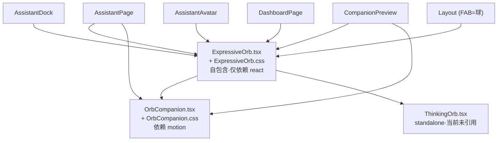

# 嘉行联 → Mochi 前端 / UI 资产盘点清单

> 盘点官：前端资产盘点官（Mochi 项目）
> 盘点对象（只读）：`/Users/a1379/Documents/联动计划/`（`src/` 及仓库根相关目录）
> 产出范围：仅做盘点，不写迁移代码。
> 红线提醒：旧项目目录**只读**，本文所有内容仅描述现状，未做任何修改。

---

## 0. 结论速览（汇总统计）

| 维度 | 规模 |
|---|---|
| 旧项目 `src/` 文件总数 | 88 个（`.ts/.tsx/.css`），约 **26,792 行** |
| **必迁**（Mochi 直接复用） | **约 44 个文件 / ~10.5k 行**（含设计令牌、Painterly 框架、liquid-glass 控件、Assistant 页、登录、Layout、api/auth 基础设施） |
| **可选**（业务域页面 / 可复用模式，按 Mochi 功能取舍） | **约 30 个文件 / ~9.5k 行** |
| **不迁**（PWA / 校园猫咪旅程 / 死代码 / 设计参考件） | **约 20 个文件 / ~6.8k 行** |
| 外部逻辑集群 `shared/`（不在 `src/` 内，页面强依赖） | 17 个文件 / **2,217 行**，需单独盘点；其中 `shared/assistant*.ts` 是 AI 代理核心逻辑 |
| 图片资产依赖 | `src/` 内引用 `/assets/*` 共 19 个（校园手绘 webp 8、猫咪角色 bible 6、品牌水母 1、评审二维码 1 等） |

> 说明：行数为 `wc -l` 实测；"必迁/可选/不迁"为**资产盘点视角的迁移价值判断**（Mochi = 基于 dsh 的桌面 AI 办公代理），最终是否迁入由迁移方案决定。

---

## 1. ExpressiveOrb 引擎专题（最重要）

### 1.1 文件清单

| 文件 | 行数 | 类型 | 依赖 | 迁移价值 | 备注 |
|---|---|---|---|---|---|
| `src/components/ExpressiveOrb.tsx` | 412 | 引擎主体 | 仅 `react` + `./ExpressiveOrb.css` | **必迁** | 自包含，零业务/零内部依赖 |
| `src/components/ExpressiveOrb.css` | 59 | 样式 | 无 | **必迁** | 焦糖色系、drop-shadow、rim，无渐变高光 |
| `src/components/OrbCompanion.tsx` | 90 | 工作台模组 | `ExpressiveOrb` + `motion/react` + `./OrbCompanion.css` | **必迁** | 球 + 小电脑 + 状态机（idle/thinking/typing/celebrate/alert/sleep） |
| `src/components/OrbCompanion.css` | 149 | 样式 | 无 | **必迁** | 全部 CSS keyframes，含 reduced-motion 降级 |
| `src/components/ThinkingOrb.tsx` | 123 | 待处理流体标记 | 仅 `react` | **必迁** | Canvas2D 渲染；**当前未被任何文件 import**（孤立备用件），属 orb 家族 |

### 1.2 依赖图谱（传递闭包）

- **自包含度**：`ExpressiveOrb` 仅 import `react` 与自身 css，不触碰任何 `lib/`/`shared/`/业务状态 → **耦合度极低**。
- **无二进制资产**：纯 SVG + `requestAnimationFrame` + 程序化 Catmull-Rom / 阻尼弹簧，无图片/spritesheet → 可直接整文件复制。
- **唯一外部依赖是 `motion`**（仅 `OrbCompanion` 用到 `useReducedMotion`），而 `motion` 已是全项目动画基座（见 §6），必迁。

### 1.3 对外 API

**Props（`ExpressiveOrbProps`）**
| 属性 | 类型 | 默认 | 说明 |
|---|---|---|---|
| `size` | `number` | `48` | 直径 px，经 `--orb-size` 注入 |
| `mood` | `ExpressiveOrbMood` | `"idle"` | `idle/thinking/listening/speaking/success/alert` |
| `active` | `boolean` | `true` | `false` 时停动画、落静止姿势 |
| `interactive` | `boolean` | `true` | 关闭则 poke 回退为 CSS 按压 |
| `label` | `string?` | — | 提供后作独立可读球（aria-label） |
| `className` | `string` | `""` | — |

**动作模组（poke 互动）**：`onPointerDown` / `onKeyDown(Enter|Space)` 触发 jelly 挤压（弹簧 `k=0.05, d=0.82`），暖色 + 抬头凝视后回弹；纯装饰，不 `preventDefault`，不阻止外层导航。

**状态机 / 调参（视图坐标 0 0 100 100）**
| Mood | 颜色（RGB 字面量） | 关键参数 |
|---|---|---|
| idle | `[160,106,50]` 焦糖 | open7.2/wide5.6/breath3.8 |
| thinking | `[111,97,76]` 暗茶褐 | lift-2.6/wobbleSpeed0.95 |
| listening | `[185,138,78]` 暖亮砂 | open8.6 |
| speaking | `[201,145,60]` 亮琥珀 | open6.4/wobble0.034 |
| success | `[168,138,64]` 蜜金 | breath4.8 |
| alert | `[162,79,40]` 赭棕 | wobbleSpeed1.5 |

> 颜色全部落在暖焦糖/琥珀带（hue≈19–45°），状态靠明度与行为区分，原地 morph 而非换色 → 满足"颜色跨度不要太大"。
> 已知特性：焦糖/琥珀色系、poke 弹簧(k0.05 d0.82)、drop-shadow、头像 30px（见 `AssistantAvatar`）、FAB 即球本身（`Layout` 中 `ExpressiveOrb` 作导航球）、**v3.1+**（代码注释含 6 项重实现 + squash&stretch + 双眨）。

---

## 2. 设计令牌与全局样式

### 2.1 文件清单

| 文件 | 行数 | 用途 | 迁移价值 | 备注 |
|---|---|---|---|---|
| `src/design/calm-tokens.css` | 74 | 全局设计令牌（颜色/圆角/阴影/字体/弹簧曲线），含 `[data-theme="dark"]` | **必迁** | 定义 `--sage-800:#45584e`（用户确认保留）、`--accent:#d9873e`、圆角 xs8~xl28/pill999 |
| `src/design/cozy-companions.css` | 78 | 吉祥猫/水母氛围样式 | **必迁** | 与 companion 体系同族 |
| `src/design/cozy-pages.css` | 625 | 页面表面/版式 | **必迁** | 内容面板奶油纸面基础 |
| `src/design/reference-ui.css` | 837 | `ReferenceUI` 组件样式 | **必迁** | 被 `PainterlyPageFrame` 硬依赖；属"参考"风格，迁移时建议清理为生产件 |
| `src/design/MaterialSurface.tsx` | 31 | 语义表面原语 | **不迁** | `grep` 显示**全项目无引用**（死代码） |

### 2.2 用户视觉红线逐条核对

| 红线 | 现状 | 结论 |
|---|---|---|
| ① 不能有塑料感 | 全局 `styles.css` 中 `linear-gradient/radial-gradient/conic-gradient` 命中 **0**；`calm-tokens` 仅 `--glass-bg` 用 `linear-gradient`（磨砂玻璃控件，非塑料高光）；`ExpressiveOrb` 的 `radialGradient` 仅作底部内阴影（重量感）。均用 `drop-shadow` 而非 gloss。 | **符合**（无塑料感） |
| ② 全项目无横向滚动条 | `styles.css` 存在 `overflow-x:auto`（`table-scroll`×2、`onboarding-steps`、`delivery-legend`）及 `width:min(...,100vw-...)`。均为**容器内/移动端局部**滚动，非整页溢出。 | **TO_VERIFY** — 迁移时需逐处复核，移除页面级 `100vw` 计算宽度，确保无整页横向滚动条 |
| ③ 有字处加圆角矩形 | 已系统化：令牌 `--radius-*`(8~28/pill999)、`Pill.tsx`(圆角胶囊)、`LiquidGlassButton`、输入/标签均有圆角。 | **符合（令牌层）** — **TO_VERIFY**（实现层需逐页核对文字容器均落圆角矩形） |
| ④ 颜色跨度不要太大 | 调色板限定焦糖/琥珀 + 鼠尾草绿(`--sage-*`) + 奶油纸面 + 墨色；`ExpressiveOrb` 6 态 hue 19–45°；dark 模式同族。 | **符合** |

---

## 3. 组件总清单（`src/components/`）

| 组件 | 路径 | 行数 | 用途 | 依赖（内部/外部） | 迁移价值 | 备注 |
|---|---|---|---|---|---|---|
| ExpressiveOrb | `ExpressiveOrb.tsx/.css` | 412/59 | AI 表情球引擎 | react / — | **必迁** | 见 §1 |
| OrbCompanion | `OrbCompanion.tsx/.css` | 90/149 | 球+小电脑工作台 | ExpressiveOrb / motion | **必迁** | 见 §1 |
| ThinkingOrb | `ThinkingOrb.tsx` | 123 | 待处理流体标记 | react / — | **必迁** | 孤立备用 |
| PainterlyPageFrame | `PainterlyPageFrame.tsx/.css` | 85/450 | 奶油纸面内容面板（用户确认保留） | ReferenceUI / TransitionLink / lucide | **必迁** | 依赖 hero 图片资产 |
| ReferenceUI | `ReferenceUI.tsx` | 559 | 画布/表面底座 | — / react-router | **必迁** | PainterlyPageFrame 硬依赖 |
| UI | `UI.tsx` | 134 | 基础件 Avatar/Badge/Loading/ErrorState/Empty/PrivacyBanner | format / LiquidBackLink / lucide | **必迁** | 被大量页面用 |
| LiquidGlassButton | `LiquidGlassButton.tsx` | 25 | liquid-glass 按钮（控件语言） | react | **必迁** | |
| LiquidToast | `LiquidToast.tsx` | 48 | 通知浮层 | motion / lucide | **必迁** | |
| LiquidBackLink | `LiquidBackLink.tsx` | 21 | 返回链接 | TransitionLink / lucide | **必迁** | |
| TransitionLink | `TransitionLink.tsx` | 39 | 路由过渡链接 | react-router / route-preload | **必迁** | |
| SquircleAnchor | `SquircleAnchor.tsx` | 49 | 圆角锚点/链接 | TransitionLink | **必迁** | |
| Pill | `Pill.tsx` | 68 | 圆角文本胶囊（红线③） | react-router / SquircleAnchor | **必迁** | |
| NavIcons | `NavIcons.tsx` | 172 | 导航图标组 | react | **必迁** | |
| Logo | `Logo.tsx` | 15 | 品牌标识 | — | **必迁** | |
| CursorLight | `CursorLight.tsx` | 65 | 氛围光标光（非塑料） | react | **必迁** | |
| AmbientLeaves | `AmbientLeaves.tsx/.css` | 38/65 | 氛围落叶背景 | lucide / react | **必迁** | |
| AssistantDock | `AssistantDock.tsx/.css` | 70/202 | AI dock（球即 FAB） | ExpressiveOrb / motion / AssistantChat / shared/assistant | **必迁** | 需剥离 pwa 调用 |
| AssistantAvatar | `AssistantAvatar.tsx` | 20 | 球头像（30px） | ExpressiveOrb | **必迁** | |
| Layout | `Layout.tsx` | 448 | 应用外壳/导航 | 大量 / motion / pwa / react-router | **必迁** | 需剥离 `registerServiceWorker`/`syncAppBadge`/`OfflineBanner` |
| AssistantChat (导出) | 见 `pages/AssistantPage.tsx` | — | 对话体（被 AssistantDock 引用） | — | **必迁** | 随 AssistantPage |
| MovementStoryCanvas | `MovementStoryCanvas.tsx/.css` | 973/369 | 学生动向猫咪旅程画布 | movement-visual / visual / SpritePlayer / shared/movement | **不迁** | 校园猫咪可视化，与 AI 代理无关 |
| JourneyCatProgress | `JourneyCatProgress.tsx` | 128 | 旅程进度猫 | types / lucide / motion | **不迁** | |
| CatCompanion | `CatCompanion.tsx` | 79 | 吉祥猫 | motion / lucide | **不迁** | 除非 Mochi 保留吉祥物 |
| SpritePlayer | `SpritePlayer.tsx/.css` | 224/54 | 精灵动画播放 | — | **不迁** | 猫咪旅程用 |
| OfflineBanner | `OfflineBanner.tsx` | 8 | 离线 PWA 横幅 | lucide / react | **不迁** | PWA 专属 |
| MaterialSurface | `design/MaterialSurface.tsx` | 31 | 语义表面 | react | **不迁** | 死代码 |

---

## 4. 页面与功能（`src/pages/`、`src/features/`、`src/visual/`、`src/hooks/`）

| 文件 | 行数 | 用途 | 依赖要点 | 迁移价值 | 备注 |
|---|---|---|---|---|---|
| `AssistantPage.tsx/.css` | 948/377 | **AI 助手页**（核心） | ExpressiveOrb/OrbCompanion + **shared/assistant**, shared/assistant-privacy + motion + api | **必迁** | Mochi 主场景；强依赖外部 `shared/assistant*` 逻辑（§7） |
| `LoginPage.tsx` | 202 | 登录页（含 judge-qr 评审二维码段落） | PainterlyPageFrame + auth + **`/assets/judge-login-qr.png`** | **必迁** | judge-qr 为静态图（L163 ``），演示/评审用 |
| `AuthSupportPainterlyPages.css` | 1146 | 登录/鉴权页样式 | — | **必迁** | 被 LoginPage 依赖 |
| `CompanionPreview.tsx` | 156 | 设计预览/截图验收页（不进业务路由） | ExpressiveOrb/OrbCompanion | **可选** | dev 验收用，可保留 |
| DashboardPage (+.reference.css) | 569/600 | 仪表盘 | ExpressiveOrb + shared/* + motion | **可选** | 校园业务页 |
| AnalyticsPage | 628 | 数据分析页 | shared/analytics-ai, class-triage, motion | **可选** | AI 分析可复用 |
| EventsPage / NewEventPage / EventDetailPage | 261/480/372 | 事件 CRUD | api/auth/format | **可选** | 校园业务 |
| MessagesPage / MessageRedirectPage | 476/96 | 消息 | shared/inbox-ai + motion | **可选** | |
| StudentsPage / StudentDetailPage | 123/137 | 学生 | api/UI/SquircleAnchor | **可选** | |
| NotificationSettingsPage (+.reference.css) | 671/715 | 通知设置（Web Push 绑定） | api + **pwa(enablePush)** | **可选但需改造** | 含 Web Push 流程，桌面改 Electron IPC |
| SystemStatusPage | 111 | 系统状态 | api/Logo | **可选** | |
| OnboardingPage | 410 | 引导 | install-prompt(pwa) + api | **可选** | 含 PWA 安装提示，需剥离 |
| AdminPage | 1125 | 管理后台 | api/auth | **可选** | |
| ActivateAccountPage / ChangePasswordPage | 88/98 | 账号激活/改密 | api/Logo/PainterlyPageFrame | **可选** | |
| MovementsPage (+.reference.css) / MovementDetailPage(+.css) / MovementJourneyPage(+.css) | 623/497 / 423/277 / 186/209 | 学生动向业务 | **movement-visual / visual / shared/movement** | **不迁** | 校园离校追踪，与 AI 办公代理无关 |
| `features/analytics/movementAnalytics.ts` | 109 | 动向分析计算 | shared/analytics(类型) | **可选** | |
| `features/movement-visual/*`（6 文件） | 1553 | 猫咪旅程清单/路线/进度/场景/档案/序列 | shared/movement + visual | **不迁** | 自包含数据，但业务无关 |
| `visual/movementVisual.ts` | 146 | 动向视觉映射 | shared/movement | **不迁** | |
| `hooks/useMotion.ts` | 341 | motion 封装 | motion | **必迁** | 多处使用 |
| `lib/motion.ts` | 318 | 注入 motion CSS 变量 | — | **必迁** | main.tsx 调用 |
| `lib/api.ts` | 134 | 请求层（fetch/重试/401 事件） | navigator/window | **必迁** | 端点需改 dsh 通道 |
| `lib/auth-context.tsx` | 53 | 鉴权状态 | api + shared 类型 | **必迁** | 端点需改 |
| `lib/format.ts` | 58 | 格式化/语气 | — | **必迁** | |
| `lib/login-errors.ts` | 15 | 登录错误映射 | api | **必迁** | |
| `lib/route-preload.ts` | 93 | 路由预加载 | react-router | **必迁** | App 硬依赖；桌面可简化/移除懒加载 |
| `lib/card-reader.ts` | 45 | 键盘楔 RFID 读卡 | — | **可选** | 校园硬件，桌面大概率不需要 |
| `lib/pwa.ts` | 208 | **Service Worker / Web Push / VAPID** | navigator.serviceWorker/PushManager/Notification | **不迁** | 桌面移除 |
| `lib/install-prompt.ts` | 31 | **PWA beforeinstallprompt** | window | **不迁** | 桌面移除 |
| `styles.css` | 1511 | 全局样式 | — | **必迁** | 需核对横向滚动红线（§2.2②） |
| `types.ts` | 160 | 前端类型 | **`../shared/types`** | **必迁** | 跨边界依赖 shared/ |
| `main.tsx` | 28 | 入口 | BrowserRouter / localStorage / install-prompt | **必迁** | 改路由策略 + 去 install-prompt |
| `App.tsx` | 91 | 路由表/守卫 | react-router / route-preload / Layout | **必迁** | 按 Mochi 功能裁剪路由 |

---

## 5. 外部逻辑集群 `shared/`（**不在 `src/` 内**，单独盘点）

| 文件 | 行数 | 用途 | 与 Mochi 关系 |
|---|---|---|---|
| `shared/assistant.ts` | 646 | **AI 代理核心逻辑**（意图解析/工具标签/目的地） | **最高价值**——AssistantPage 强依赖 |
| `shared/assistant-privacy.ts` | 404 | 助手隐私策略 | 高价值 |
| `shared/assistant-project-context.ts` | 20 | 项目上下文 | 高价值 |
| `shared/analytics-ai.ts` | 347 | AI 分析 | 可选 |
| `shared/inbox-ai.ts` | 157 | 收件箱 AI | 可选 |
| `shared/class-triage.ts` | 134 | 班级分诊 | 可选 |
| `shared/event-intelligence.ts` | 64 | 事件智能 | 可选 |
| `shared/dashboard-greeting.ts` | 79 | 问候 | 可选 |
| `shared/movement.ts` | 106 | 动向类型 | 不迁（业务） |
| `shared/analytics.ts` | 47 | 分析类型 | 可选 |
| `shared/constants.ts` / `validation.ts` / `types.ts` / `time.ts` / `dorm.ts` | 55/41/35/59/23 | 通用 | 按引用取舍 |

> **重要**：`shared/` 是 `src/pages` 的强依赖（尤其 `assistant*`），但**不在本次 UI 资产盘点范围**。迁移任何页面都必须先盘点/迁移对应的 `shared/*`。建议作为独立任务处理。

---

## 6. 外部依赖（`package.json`）与 License

### 6.1 前端运行时依赖（Mochi 需保留）

| 包 | 版本 | 类别 | License（TO_BE_VERIFIED） | 迁移价值 | 备注 |
|---|---|---|---|---|---|
| `react` | ^19.2.0 | UI 框架 | TO_BE_VERIFIED（常见 MIT） | **必迁** | |
| `react-dom` | ^19.2.0 | 渲染 | TO_BE_VERIFIED（常见 MIT） | **必迁** | |
| `react-router-dom` | ^7.18.2 | 路由 | TO_BE_VERIFIED（常见 MIT） | **必迁** | 桌面建议改 HashRouter/MemoryRouter |
| `lucide-react` | ^0.468.0 | 图标 | TO_BE_VERIFIED（常见 ISC） | **必迁** | |
| `motion` | ^13.0.0 | 动画 | TO_BE_VERIFIED（常见 MIT，原 framer-motion） | **必迁** | OrbCompanion/Layout/众多页面依赖 |

> License 一律需在迁移前用 `pnpm licenses list` 或读取 `node_modules/<pkg>/LICENSE` **复核**。**GPL 与"无 License"不可用**（用户红线）。上表常见许可均为宽松许可（MIT/ISC），但须以实际产物为准。

### 6.2 不迁入的前端/后端依赖

| 包 | 类别 | 迁移价值 | 备注 |
|---|---|---|---|
| `@block65/webcrypto-web-push` | Web Push 加密（**后端/Workers**） | **不迁** | 前端不引入；桌面通知走主进程 |
| `hono` | 服务端框架（Cloudflare Workers） | **不迁** | 后端，与桌面前端无关 |
| `pg` | Postgres 客户端（服务端） | **不迁** | 后端 |
| `qrcode` + `@types/qrcode` | **devDependency**，仅 `qr:judge` 构建脚本用 | **不迁** | judge 二维码为静态 PNG，运行时无需 |

### 6.3 构建/测试链（均不迁入 Mochi 前端）

`@cloudflare/vite-plugin`、`@cloudflare/vitest-pool-workers`、`@cloudflare/workers-types`、`@types/*`、`@vitejs/plugin-react`、`@vitest/coverage-v8`、`esbuild`、`typescript`、`vite`、`vitest`、`wrangler` —— Mochi 改用 dsh 自有构建体系。

---

## 7. 桌面 APP 适配性分析

### 7.1 浏览器 / Web API 依赖清单

| API / 用法 | 出现位置 | 桌面（Electron 渲染进程）适配 |
|---|---|---|
| `BrowserRouter` | `main.tsx` | 建议改 `HashRouter`/`MemoryRouter`（避免 `file://` 路径问题）— 中 |
| `localStorage`（`theme`） | `main.tsx` | 渲染进程仍有 localStorage，可保留；建议改主进程持久化 — 低 |
| `fetch` / `Headers` | `lib/api.ts` | 渲染进程支持；但端点 `/api/*` 需改 dsh IPC 通道 — 中 |
| `navigator.onLine` | `api.ts` / `OfflineBanner` | 桌面网络由 harness 管理，`OfflineBanner` 移除 — 低 |
| `matchMedia(prefers-reduced-motion)` | ExpressiveOrb/ThinkingOrb/众多 | 渲染进程支持，**保留**（无障碍） |
| `requestAnimationFrame` / `performance.now` / `devicePixelRatio` | Orb / ThinkingOrb | 渲染进程支持，**保留** |
| `window.dispatchEvent` (AUTH_INVALID) | `api.ts`/`auth-context` | 保留（进程内事件） |
| `useSearchParams` / `window.location` | 多页 | 路由改造时统一处理 |
| `@media (max-width:640px)` 响应式 | 多 css | 桌面固定窗口意义有限，可保留为最小窗口适配或简化 — 低 |

### 7.2 PWA 处理方案（桌面不需要）

| 资产 | 位置 | 处理 |
|---|---|---|
| `public/manifest.webmanifest` | 仓库根 `public/` | **删除**（PWA manifest） |
| `public/sw.js` | 仓库根 `public/` | **删除**（Service Worker） |
| `src/lib/pwa.ts` | — | **不迁**（SW 注册 / Web Push / VAPID / setAppBadge） |
| `src/lib/install-prompt.ts` | — | **不迁**（`beforeinstallprompt`） |
| `src/components/OfflineBanner.tsx` | — | **不迁** |
| 调用点 | `main.tsx`(install-prompt import)、`Layout.tsx`(`registerServiceWorker`/`syncAppBadge`/`OfflineBanner`) | **移除调用** |

> **通知策略**：Web Push/VAPID 不迁入；桌面通知改走 **Electron 主进程原生 Notification / IPC**（Mochi 的 dsh 体系）。`Notification` API 在渲染进程仍可用，但订阅/推送逻辑整体废弃。

### 7.3 响应式适配

旧项目为 Web/PWA（手机/平板/桌面响应式）。Mochi 是**桌面固定窗口 APP**，手机/平板断点意义不大；建议迁移时：
- 保留 `prefers-reduced-motion` 与最小窗口兜底；
- 移除页面级 `100vw` 计算宽度（§2.2②），改为窗口内宽度，杜绝横向滚动条；
- 复杂 `@media (max-width:640px)` 块可简化为单一桌面布局。

---

## 8. 不确定项（`TO_BE_VERIFIED`）

1. **所有 npm 包 License**：见 §6.1，须用 `pnpm licenses list` 或 `node_modules/<pkg>/LICENSE` 复核；确认无 GPL / 无 License。
2. **横向滚动条**：§2.2② 所列 `overflow-x:auto` 四处与 `100vw` 计算宽度，需逐页验证非整页溢出。
3. **圆角矩形覆盖**：§2.2③ 实现层需逐页确认所有文字容器均落圆角矩形。
4. **`Logo.tsx` 是否内联 SVG**：若用 `/assets/brand/jiaxing-jellyfish-v1.png`，则该图片资产需一并迁移（标记可选）。
5. **`shared/` 全量盘点**：本次仅列文件与行数（§5），未展开逐函数依赖，建议作为独立迁移任务。
6. **图片资产归属**：`/assets/campus/painterly/*`(8) 随 PainterlyPageFrame 的页面走（若页面可选则资产可选）；`/assets/characters/*`(6) 随猫咪特性不迁。

---
*盘点完成。本文件仅描述旧项目现状，未对任何旧项目文件做读取以外的操作。*
