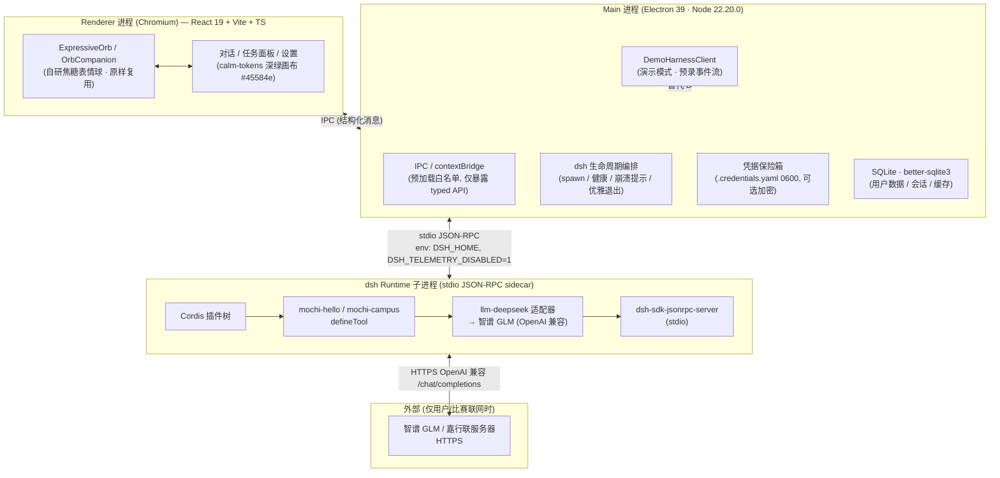

# 08 · Mochi 桌面 APP 架构设计（目标态）

> 本文是「嘉行联 · Mochi」向桌面 APP 迁移的**目标态架构**，供迁移清单（后续文档）对照。
> 读者是审核官。凡无源码/官方事实支撑处，一律标注 `TO_BE_RESOLVED_BY_CODEX`，不编造类名、版本号、API。
> 现实约束贯穿全文：**高中生 / 26 天 / 零付费 / 比赛现场不能翻车 → 稳定优先于功能数量。**

---

## 0. 结论速览（先给拍板结论）

| 项 | 结论 |
|---|---|
| 外壳 | **Electron 39.x**（自带 Node 22.20.0 ≥ dsh 要求的 22.19） |
| 前端 | React 19 + Vite + TypeScript（复用 `ExpressiveOrb.tsx`，原样不动） |
| dsh 驱动 | 主进程用 `@deepseek-ai/dsh-sdk-client` 的 `DeepSeekHarness`/`HarnessClient` spawn **dsh 子进程**，走 **stdio JSON-RPC**（`--profile mochi`）。**不重写进程管理**——SDK client 已内置 spawn/健康检查/拆解梯。 |
| Node ≥22.19 解法 | **随包发布 Node 22.20 二进制 + dsh 构建产物 + 1 行 launcher**，`dshBin` 指向 launcher。Electron 自带 Node 只服务于主进程本身，子进程用随包 Node（见 §2.4，这是 sidecar 方案的必要代价，已权衡）。 |
| `api/` HTTP Remote 层 | **桌面端不需要**。那是给 `bundle/web-app` 的浏览器 Client↔Host 通道。桌面走 `sdk/` stdio 即可。 |
| DSH_HOME | 运行时态：`~/Library/Application Support/Mochi/dsh-home`（Mac）/ `%APPDATA%/Mochi/dsh-home`（Win）。`.nosync` 后缀是**开发期**躲 iCloud 用，打包后不必带（Application Support 默认不同步）。 |
| 遥测 | 子进程 env 设 **`DSH_TELEMETRY_DISABLED=1`**（任意非空值即禁用 `session-telemetry-otel`，源码 `apps/cli/src/profile-boot.ts:78-104` 已核实）。 |
| 数据库 | D1(SQLite) → 桌面用 **`better-sqlite3`**（Node 22 原生 `node:sqlite` 仍 experimental，比赛不赌）。 |
| 签名 | Mac 不买 ¥688 开发者账号 → **不签名 + 演示机预置 `xattr -cr`/右键打开预案**；Win 不买 EV → **SmartScreen 弹窗靠现场"更多信息→仍运行"点掉**。见 §5。 |
| 演示模式 | **必须有**：`DemoHarnessClient` 实现与真实 client 相同的接口，返回预录事件流，球动画/UI 与真实态一致。现场网络/LLM 翻车时一键切。见 §7.3。 |
| 最大风险 | dsh 是 **Developer Preview**（breaking change 风险）+ 比赛当天网络/限流不确定 → 靠「演示模式 + 双模型兜底 + 预置签名降级预案」三条兜底。 |

---

## 1. 桌面 APP 技术选型

### 1.1 Electron vs Tauri

**首选：Electron 39.x**

- **理由**
  1. **Node 版本天然达标**：Electron 39 自带 **Node 22.20.0**，正好满足 dsh 的「Node ≥ 22.19」硬要求（见 §1.2）。Tauri 用系统/Rust 工具链，dsh 的 Node 运行时需另起 sidecar，反而多一层。
  2. **React .tsx 零摩擦**：Electron renderer 即 Chromium，直接吃现有 `ExpressiveOrb.tsx`（React 19），Vite dev server / HMR 一套成熟链路，26 天内最稳。Tauri 的 webview 是系统 WebView（macOS WKWebView / Win WebView2），React 19 + 自研 rAF 引擎在 WebView2 上需额外验证，时间不划算。
  3. **dsh 集成最省**：dsh 是 ESM Node 程序 + Cordis，Electron 主进程本身就是 Node，可直接 `import` dsh 的 SDK client 库，进程模型匹配。
  4. **打包/签名社区方案最全**：electron-builder 一把梭，遇到问题 Stack Overflow 答案最多——对高中生独立作战是关键安全网。

- **备选方案：Tauri 2.x（sidecar 跑编译后的 dsh 二进制）**
  - 体积更小（~10MB vs Electron ~100MB+）、内存更省、Rust 边框更安全。
  - 切换条件：**仅当** Electron 打包体积/签名在比赛机器上成为硬障碍，且团队愿意为 React 19 在系统 WebView 的兼容性额外花 3–5 天验证。本时间线下不建议。

- **其他（Flutter/RN/纯原生）**：直接排除。无法复用 `.tsx` 表情球，且 dsh 是 Node 程序，与这些运行时格格不入。

### 1.2 Node 版本（你点名的致命点）——已查实，非猜测

dsh 要求 **Node ≥ 22.19**。Electron 各版本内置 Node（来源：Electron 官方 release blog，2025-2026）：

| Electron | 内置 Node | 是否满足 dsh ≥22.19 |
|---|---|---|
| 37 | 22.16.0 | ❌ |
| **38** | **22.18.0** | **❌ 差一点，不满足** |
| **39** | **22.20.0** | ✅ |
| 40 | 24.11.1 | ✅（2026-01 发布） |

**结论：锁定 Electron 39.x（Node 22.20.0）。不要用 38——它只到 22.18.0，恰好卡在 22.19 之下，会启动即崩。**

**子进程的 Node 怎么来（关键）**：Electron 的 Node 只给主进程用；主进程 spawn dsh 子进程时，**Electron 的二进制不能当 `node` 复用**（会再起一个 Chromium，巨慢且错）。因此 dsh 子进程必须自带 Node ≥22.19——方案见 §2.4。一句话：**Electron 39 解决「主进程 Node 够不够」，随包 Node 解决「子进程 dsh 的 Node 够不够」，两层都达标。**

### 1.3 前端框架
React 19 + Vite + TypeScript。renderer 用 Vite 构建，主进程用 Vite（或 tsx/esbuild）构建。`ExpressiveOrb.tsx` 原样搬入，不动风格（用户红线）。

---

## 2. dsh Runtime 集成

### 2.1 首选：SDK TypeScript client 驱动子进程（stdio JSON-RPC）

**直接复用 dsh 官方驱动，不自造轮子。**

- 主进程依赖 `@deepseek-ai/dsh-sdk-client`（源码 `packages/sdk/client/README.md` 已核实）。它提供：
  - `DeepSeekHarness`：高层「spawn → open session → run(prompt) → 收 finalResponse + events」。
  - `HarnessClient`：底层 `start/initialize/prompt/request/close` + 通知订阅 `subscribe` / `subscribeSessionTree`。
  - **已内置完整进程生命周期**：惰性启动、10s `initialize` 握手超时（超时信息带 profile 名 + stderr 尾）、`stdin EOF → SIGTERM → SIGKILL` 拆解梯、`close()` 幂等、四类 typed error（`JsonRpcResponseError`/`RequestTimeoutError`/`SdkProtocolError`/`TransportClosedError`）。
- 调用形态（据 `sdk/client/README.md` 示例）：
  ```ts
  await using harness = new DeepSeekHarness({
    profile: 'mochi',                 // 我们的桌面 profile（见 §2.5）
    patches: ['./mochi.cordis.patch.yml'],
    provider: 'deepseek-official',    // 直连适配器
    model: 'glm-4-flash',             // 免费档
    reasoningEffort: 'off',
    dshBin: '/Applications/Mochi.app/Contents/Resources/run-dsh',  // 见 §2.4
    env: { DSH_HOME: '...', DSH_TELEMETRY_DISABLED: '1', ... },
  })
  ```
- **为什么用 `sdk/` 而非 `api/`**：`packages/api/` 是给 Web UI 的 Remote/HTTP 层（Client↔Host 经共享 Connection + Typert Gateway），桌面端无浏览器 Client，不需要起 HTTP 服务。`sdk/` 的 stdio JSON-RPC 正是 out-of-process 驱动模型，且与你已跑通的 `mochi.sh --profile ...` 同源。

**备选：主进程内嵌 dsh（import `runProfile` from `@deepseek-ai/dsh-app-boot`，同进程 Cordis）**
- 优点：白嫖 Electron 39 的 Node 22.20，省掉随包 Node；无序列化损耗。
- 缺点：偏离已验证的 stdio 模型；Cordis 单例/事件总线可能与主进程其他逻辑冲突；Developer Preview API 变动会直接打穿主进程。
- 切换条件：**仅当** sidecar 在签名/打包上卡死，且有把握处理 Cordis 同进程隔离。

### 2.2 进程生命周期管理（由 SDK client 托管，主进程只做编排）
- **启动**：懒启动（首次 `run` 时），主进程无需抢跑。
- **健康检查**：以 `initialize` 握手（默认 10s 超时）作为就绪信号；超时即视为启动失败，client 已返回带 stderr 的 `AggregateError`。
- **崩溃重启**：`TransportClosedError`（exit code + stderr 尾）触发 UI 切 `alert` 并提示；如需自动拉起，主进程捕获该 error 后重建 `DeepSeekHarness` 实例（client 自身在「握手失败但清理成功」时也会装新 client 重试）。**首版不自动无限重启**——避免 dsh 死循环把机器拖死，改为「崩了→提示→用户/演示模式接管」。
- **优雅退出**：app 退出前调用 `harness.close()`（或 `await using` 自动），client 走 `shutdown` 请求 → stdin EOF → SIGTERM → SIGKILL 阶梯，保证子进程必被回收，不留僵尸。

### 2.3 DSH_HOME 放哪
- **运行时态（打包后）**：
  - Mac：`~/Library/Application Support/Mochi/dsh-home/`
  - Win：`%APPDATA%/Mochi/dsh-home/`
  - 内含：`settings.yaml`（热加载用户配置）、`.credentials.yaml`（0600，API Key）、`sessions/`、`storages/`（SQLite）、`profiles/`。
- **开发态**：沿用现有 `.mochi-home.nosync/`（项目内 + `.nosync` 躲 iCloud），通过 `DSH_HOME` env 注入，与打包后路径解耦。

### 2.4 Node ≥22.19 的落地（打包后约束的解法）
旧项目坑：pnpm 建的是相对 symlink，`DSH_HOME` 必须在项目内；`.nosync` 躲 iCloud。**打包后这些约束消失**——dsh 不再以 pnpm dev 模式运行，而是构建为扁平产物随包发布。

**首选：随包 Node 22.20 + dsh 构建产物 + 1 行 launcher**
- 构建期：用 tsdown（dsh 自带 `tsdown.config.ts`）把 dsh 各 package 构建为 `lib/`，连同 `node_modules` 生产依赖，扁平拷到 `app/dsh/`。下载 **Node 22.20.x 官方二进制**（Mac arm64/x64、Win x64）放进 `app/resources/node/<platform>/`。
- `dshBin` 指向一个 1 行 launcher：
  - Mac：`resources/run-dsh`（sh）：`exec "$(dirname "$0")/node/darwin/arm64/bin/node" "$(dirname "$0")/dsh/lib/bin.js" "$@"`
  - Win：`resources/run-dsh.cmd`：`@"%~dp0\node\win\x64\bin\node.exe" "%~dp0\dsh\lib\bin.js" %*`
- 主进程把 `dshBin` 设到该 launcher 绝对路径，`DeepSeekHarness` 照常 spawn。
- **理由**：版本绝对可控（永远 22.20 ≥ 22.19）；构建就是把现有 `mochi.sh` 逻辑搬进打包脚本，最省事；崩溃隔离；与已跑通模型一致。
- **代价**：随包多 ~50–70MB Node 二进制。对比赛 Demo 可接受（换来「绝不因 Node 版本翻车」）。

**备选 A：Node SEA 单可执行文件**
- 把 dsh 用 `node --experimental-sea-config` + `postject` 烤成单一原生二进制（Node 22.20 内置），`dshBin` 直接指向它，无需单独 Node 目录。
- 优点：更干净、少一堆文件。
- 风险：SEA 对 ESM + 动态 `import()`（Cordis loader/HMR）兼容性需实测；26 天里是「锦上添花」不是「雪中送炭」。
- 切换条件：体积/文件数成问题，且抽出 1–2 天验证 SEA 对 dsh 动态 import 的兼容。

**备选 B：见 §2.1 内嵌方案**（省随包 Node，但有同进程风险）。

### 2.5 Mochi 的 dsh profile
- 新建 `mochi` profile（参照 `packages/bundle/sdk-app/cordis.patch.yml` 的结构）：继承 `dsh-base`，**必须保留 `dsh-sdk-jsonrpc-server` 插件**（否则 client `initialize` 失败，源码 `sdk-app/README.md` 已警告），挂载 `mochi-hello` / `mochi-campus`（`@deepseek-ai/dsh-tools` 的 `defineTool`），并配置 `llm-deepseek` 适配器指向智谱 `baseURL`（沿用现有 `settings.yaml` 逻辑）。
- 用户层 patch：`$DSH_HOME/cordis.patch.yml` 作 home-level 覆盖层（源码 `profile-boot.ts:64-72` 已核实，作用于每个 profile 之上）。
- 已有插件目录 `/Users/a1379/Documents/Mochi/plugins/`（mochi-hello, mochi-campus, cordis.yml）原样打包进 `app/dsh/plugins/`。

---

## 3. 进程与通信架构



**职责边界与切分理由**
- **Renderer**：只负责「画球 + 画界面 + 收用户输入」。不含任何 dsh/密钥逻辑（密钥不出主进程）。
- **Main**：唯一信任边界。持有 `DSH_HOME`、凭据、DB；通过 contextBridge 向 renderer 暴露**最小白名单 API**（发 prompt、收事件流、切演示模式、存 key）。进程管理编排在此。
- **dsh 子进程**：纯能力执行体（工具调用、LLM 编排、A2A）。崩溃不影响 UI；经 stdio 只吐 JSON-RPC 帧（stdout 纯度由 sdk-app 保证，源码 `sdk-app/README.md` 已确认）。
- 为什么 Renderer 不直接连 dsh：保持「UI 与运行时解耦」，且密钥/数据只在主进程——符合「校园数据不出校」与最小暴露面。
- 为什么用 stdio 而非内嵌 HTTP：stdio 是 dsh 官方 SDK 通道，无需在桌面起监听端口（避免 localhost 端口被占用/被扫的安全面）。

---

## 4. ExpressiveOrb 集成方案

### 4.1 依赖闭包（已读 `src/components/ExpressiveOrb.tsx` 核实，未编造）
- **直接依赖**：`react`（仅 `useEffect/useId/useMemo/useRef/useState` + 类型）、同目录 `./ExpressiveOrb.css`。
- **零业务依赖**：不 import 旧项目任何 store / API / 工具函数。纯 SVG + 单 `requestAnimationFrame` 循环 + 阻尼弹簧积分器，自包含。
- **运行环境依赖**（renderer 提供即可）：`window.matchMedia('(prefers-reduced-motion: reduce)')`、`requestAnimationFrame`、`performance.now()`、`useId`——Electron Chromium 全部原生支持。
- **移植动作**：把 `ExpressiveOrb.tsx` + `ExpressiveOrb.css` 原样拷入 `apps/desktop/src/orb/`，import 即用，**不改一行渲染逻辑**。
- **注意：`OrbCompanion.tsx` 额外依赖 `motion/react`（framer-motion 的 `useReducedMotion`）**。若要在桌面端用「球 + 小电脑」工作台模组的 `OrbCompanion`，需装 `motion` 包（`package.json` 中 React 为 `^19.2.0`）。**只想要纯球则只用 `ExpressiveOrb`，零额外依赖。建议首版只用 `ExpressiveOrb`，`OrbCompanion` 作为增强备选。**

### 4.2 状态枚举（源码 `ExpressiveOrb.tsx:37-43` 原文）
```ts
type ExpressiveOrbMood = "idle" | "thinking" | "listening" | "speaking" | "success" | "alert"
```
- 另有 `active`（false 时静止）、`interactive`（poke 响应开关）props。
- 配色与行为全部在 `TUNING`/`MOOD_COLOR`（`:72-99`）内按暖焦糖/琥珀带插值，**不跳 hue**——天然满足用户「颜色跨度不要太大」「塑料感」红线。

### 4.3 dsh SDK 事件 → 球状态映射
SDK client 暴露 `subscribe` / `subscribeSessionTree`，事件含 `agent/inbox/spliced`、`assistant/message`、`subagent.started`、whole-agent `idle`（据 `sdk/client/README.md`）。映射表：

| dsh 运行时事件 / 状态 | Orb mood | 说明 |
|---|---|---|
| client 握手/初始化中 | `thinking` | 等待 `initialize` 完成 |
| turn 进行中、工具执行、模型推理 | `thinking` | 对应 `thinking` 调参（暗茶褐、呼吸快） |
| 收到 `assistant/message` 流式文本 | `speaking` | 亮琥珀、开口 |
| 等待人工审批（`interaction/user-approval` 插件触发） | `alert` | 赭棕示警，提示「需要留意」 |
| whole-agent `idle`（任务完成） | `success` → `idle` | 先 `success`（蜜金）再回落 `idle` |
| `TransportClosedError` / 崩溃 | `alert` | 提示后转演示模式或重连 |
| （可选）语音输入开启 | `listening` | **首版不做语音则 `listening` 保留不用**，`TO_BE_RESOLVED_BY_CODEX`：是否接入麦克风输入 |

- 映射逻辑放在 Main 进程的事件桥里：把 SDK 通知转成 `{ mood, text }` 经 IPC 推给 renderer，renderer 仅 `setMood()`。UI 不感知 dsh 协议细节。

---

## 5. 打包与分发（比赛的实际障碍）

### 5.1 打包工具
**首选：electron-builder**（配置简单、跨 Mac/Win、dmg/exe 一站式；与 electron-forge 比，yaml 配置对新手更友好）。
- 要点：`files` 含 `apps/desktop/dist` + `app/dsh/`（dsh 产物）+ `app/resources/node/`（随包 Node）+ `plugins/`；`asar` 建议**对 dsh/node 目录设 `unpack`**（原生二进制/动态 import 不应进 asar）。
- 产物：Mac `Mochi-0.1.0-arm64.dmg` + `x64`；Win `Mochi-0.1.0-x64.exe`（NSIS）。

### 5.2 Mac Gatekeeper（无 ¥688 开发者账号）

**首选：不签名，靠现场预案兜底**
- 不签名后果：双击 `.app` 弹「无法打开，因为无法验证开发者」→ 首次需「右键 → 打开」或 `xattr -cr`（见下）。**功能完全正常**，仅首次打开多一步。
- **降级方案（演示当天实操）**：
  1. 提前在演示机执行一次：`sudo xattr -cr /Applications/Mochi.app`（清 quarantine 标记），之后双击直达。
  2. 或引导评委：`系统设置 → 隐私与安全性 → 仍要打开`。
  3. 自签名（仅消除部分警告，不等同公证）：`codesign --force --deep -s - /Applications/Mochi.app`。**注意**：ad-hoc 自签名**不能**绕过 Gatekeeper 对未公证 app 的拦截，仅对内部组件校验有用；不能依赖它替代方案 1/2。
- **备选：借学校/集团 Apple 开发者账号签名+公证**。切换条件：若嘉祥集团或学校能提供当年有效账号（问指导老师），则走正规 `notarytool` 公证，体验最佳。

### 5.3 Windows SmartScreen（无 EV 证书）
- 不签名后果：双击 `.exe` 弹「Windows 已保护你的电脑 / SmartScreen 拦截」。
- **降级方案**：弹窗点「更多信息」→「仍要运行」即可继续。**功能正常**。无 EV 证书无法消除此弹窗（普通代码签名证书也未必压得住 SmartScreen 信誉机制）。
- 备选：正规 EV 证书（数千元/年，超预算，排除）。或请学校 IT 在演示机预先放行。

### 5.4 产物体积预估
- Electron 运行时 ~90–110MB（asar 后）；dsh 构建产物 ~20–40MB；随包 Node 22.20 ~50–70MB（按平台）；better-sqlite3 原生模块 ~5MB；SQLite 数据初始可忽略。
- **合计单平台安装包约 180–240MB，安装后约 250–350MB**。对本地 Demo 可接受。若要瘦身，优先执行 §2.4 备选 A（SEA 省掉独立 Node 目录）。

### 5.5 演示当天实操预案（必须演练）
1. 自带两台设备（Mac + Win 各一），提前一天在**目标演示机**上各跑一遍：装好、打开、跑通 3 个预设场景。
2. Mac 演示机提前 `xattr -cr`；Win 演示机提前点过一次 SmartScreen 放行。
3. 全程**演示模式优先**（§7.3）：网络不稳也丝滑；仅当要展示「真实联网调用智谱」时再切真实模式，并备好双模型兜底。
4. 准备 30 秒口播：「本演示以内置演示模式确保稳定，真实模式已接入免费智谱 GLM」——把限制转成亮点。

---

## 6. 数据与隐私

### 6.1 D1(SQLite) → 桌面 SQLite
- **首选 `better-sqlite3`**：同步 API、成熟、文档多。Node 22 的 `node:sqlite` 仍 **experimental**（TO_BE_RESOLVED_BY_CODEX：确认 22.20 是否仍 experimental 及稳定性），比赛不赌原生模块。
- 迁移：D1 的 SQL 是标准 SQLite 方言，大部分 `CREATE TABLE` / `INSERT` / `SELECT` 直接复用；需改的：
  - D1 特有 `?`/`?1` 占位与某些 PRAGMA 差异（D1 基于 SQLite 3.3x，better-sqlite3 用新版，通常向前兼容）。
  - 自增/类型亲和性微调；`BLOB`/`JSON` 列行为一致。
  - 旧项目 `worker/lib/assistant-tools.ts` 中 14 个工具若依赖 D1 client，需抽象出存储接口，桌面端用 better-sqlite3 实现。**具体迁移 diff 留待迁移清单文档逐项核。**

### 6.2 数据文件位置
- 全部放 `DSH_HOME`（§2.3）：`storages/` 下 SQLite、`sessions/`、`.credentials.yaml`。不放 `App` 目录（App 目录可能被更新覆盖/只读）。
- 首次启动若 `DSH_HOME` 不存在，主进程创建并写入默认 `settings.yaml`（智谱 `baseURL` + `glm-4-flash` 默认）。

### 6.3 教师自助填 API Key 流程
- **场景**：比赛评委/试用教师可能填自己的智谱/DeepSeek Key（用户自己只有 ¥2 DeepSeek，默认用免费 glm-4-flash）。
- **UI**：设置面板一个「模型与密钥」卡片（圆角矩形，符合红线）。字段：提供商（智谱/DeepSeek）、API Key（password 输入）、默认模型。提交即写 `DSH_HOME/.credentials.yaml`。
- **存储与安全**：
  - 文件权限 `0600`（沿用 dsh 现有约定，源码 `mochi.sh` 环境已用）。
  - 主进程写、renderer 只见掩码（`****`）。**可选增强**：用 `keytar`/系统钥匙串存 Key（Mac Keychain / Win Credential Manager），避免明文落盘——但 `keytar` 需原生编译，26 天里列为「有空再做」，首版先用 0600 文件 + 掩码显示，明确告知用户这是本地明文。
  - 仅当用户输入了 Key 才覆盖默认智谱免费档；不填则用内置免费档，零配置可用。

### 6.4 遥测必须关干净 + 验证
- **关闭**：主进程 spawn dsh 子进程时，env 注入 `DSH_TELEMETRY_DISABLED=1`。源码 `apps/cli/src/profile-boot.ts:78-104` 核实：任意非空值即把 `session-telemetry-otel` 插件置 `disabled: true`，且该开关「off-by-mistake 优先」（非空即关）。
- **验证真的关了**（演示前必做）：
  1. 启动后用 `./mochi.sh --dump-config`（或 `dsh --profile mochi --dump-config`）查装配表，确认 `session-telemetry-otel` 行带 `disabled: true`。
  2. 抓包验证：演示机开 Wireshark/Charles，跑一轮任务，确认**无任何**发往 `harness-telemetry.deepseeksvc.com` 的 HTTPS 请求。
  3. 在隔离网络（断网）跑，确认无超时/重试外联导致的卡顿。
- 这三条任一可证明关闭；第 2 条最硬。

---

## 7. 离线与降级

### 7.1 没网怎么办
- dsh 的 LLM 调用需 HTTPS 到智谱。断网 → `run()` 抛 `JsonRpcResponseError`/网络 error。
- **策略**：主进程捕获网络类错误 → UI 顶部常驻「离线」横幅（圆角矩形、赭棕 `--danger` 系但暖调）→ 自动降级到**演示模式**（§7.3）或提示用户联网。数据/历史查询（better-sqlite3 本地）不受影响，仍可用。

### 7.2 LLM 挂了 / 限流（glm-4-flash 免费档会限流）
- **双模型兜底**：`settings.yaml` 已列 `glm-4-flash`（默认）+ `glm-4.7-flash`（备选）。主进程检测到 429/限流 error → 自动切 `glm-4.7-flash` 重试该 turn（dsh `agent-default-model` 可经 patch 改 provider/model）。
- **仍失败**：转演示模式或明确提示「模型暂不可用，稍后重试」，不静默卡死。
- 监控：`glm-4-flash` 工具调用率实测 100% 但有限流；`glm-4.7-flash` 限流更狠（22%）。首版以 4-flash 为主、4.7-flash 为兜底。

### 7.3 演示模式（比赛关键保险，必须有）
- **设计**：实现 `DemoHarnessClient`，**与真实 `HarnessClient` 同接口**（`start/initialize/prompt/subscribe/close` + `subscribeSessionTree`）。主进程在「演示模式开 / 网络错 / LLM 连续失败」时切到它。
- **行为**：从本地 fixture（JSON 事件序列）按真实节奏回放——含 `thinking`→`speaking`→`success` 的事件流与示例文本，让**球的动画与 UI 与真实态完全一致**，仅内容非实时生成。
- **预录内容**：3–5 个真实教师办公场景（如「统计本周超时未归学生」「生成家长会通知」「把表格转成 D1 迁移 SQL」），脚本化多轮 + 工具调用展示。
- **切换入口**：设置面板「演示模式」开关 + 错误自动降级。默认**演示当天建议开演示模式**确保零翻车，真实联网作为「加分展示」按需开。
- **绝不**让演示模式只是「假按钮」——它要真能跑通完整交互循环，评委随便点都顺。

---

## 8. 完整目录结构

```
Mochi/
├── apps/
│   └── desktop/                # 桌面 APP 源码（Electron 主进程 + renderer）
│       ├── src/
│       │   ├── main/           # 主进程：IPC、dsh 生命周期编排、凭据/DB、DemoHarnessClient
│       │   ├── preload/        # contextBridge 白名单
│       │   ├── renderer/       # React 19 UI（对话/任务/设置）
│       │   ├── orb/            # ExpressiveOrb.tsx + .css（原样搬入，不动）
│       │   └── demo/           # 演示模式 fixture（预录事件流/场景脚本）
│       ├── electron-builder.yml# 打包配置（含 dsh/node unpack）
│       └── vite.config.ts
├── dsh/                        # dsh 构建产物（tsdown 输出 lib/ + 生产依赖），随包发布
│   ├── lib/                    # dsh bin.js 与各 package 构建结果
│   ├── plugins/                # mochi-hello / mochi-campus / cordis.yml（原样）
│   └── node/                   # 随包 Node 22.20 二进制（按平台）
├── plugins/                    # Mochi dsh 插件源码（与 dsh 内 plugins 同步）
│   ├── mochi-hello/
│   ├── mochi-campus/
│   └── cordis.yml
├── skills/                     # dsh skill 定义（如有）
├── assets/                     # 图标、安装背景、 calm-tokens.css（深绿画布令牌）
├── plan/                       # 计划文档（本文件所在）
│   └── 08_DESKTOP_APP_ARCHITECTURE.md
├── scripts/                    # 构建/打包辅助（拷 dsh、下 Node、xattr 预清）
├── mochi.sh                    # 现有 headless 入口（开发期保留，迁移后归档）
└── package.json                # 桌面 APP 根（管理 apps/desktop + dsh 依赖）
```

---

## 9. 风险与最大不确定性（给审核官挑刺用）

1. **dsh 是 Developer Preview（v0.1.2-rc.1）**：breaking change 风险真实存在。SDK client / `runProfile` / `cordis.patch.yml` 结构可能在正式版变动 → 迁移时以当时源码为准，本架构的 profile/调用形态若对不上，以 dsh 新文档校正。**不为「能一直兼容」打包票。**
2. **`node:sqlite` 是否够稳**：首版选 `better-sqlite3` 规避；若未来换原生模块，需重测（TO_BE_RESOLVED_BY_CODEX）。
3. **SEA 单文件可行性未实测**：§2.4 备选 A 对 dsh 动态 import 的兼容需实测，未承诺。
4. **未签名分发的现场摩擦**：Gatekeeper/SmartScreen 的「多一步」无法根除，只能靠 §5.5 预案。这是零预算的硬代价，已如实呈现。
5. **语音/监听态**：`listening` mood 首版不接麦克风，保留不用；是否要语音输入待定（TO_BE_RESOLVED_BY_CODEX）。
6. **D1→better-sqlite3 的 SQL 差异**：具体迁移改动留待迁移清单逐项核，本文只给方向。
7. **Electron 39 锁定**：若 dsh 未来要求 Node > 22.20（如 22.2x 或 23+），Electron 40（Node 24.11.1）是现成升级位，但需重测 Chromium/V8 兼容。

> 一句话兜底原则：**任何一层翻车，都有下一层接住——dsh 崩有 UI 提示，LLM 挂有双模型，网络断有演示模式，签名告警有现场预案。** 稳定优先，演示必成。
