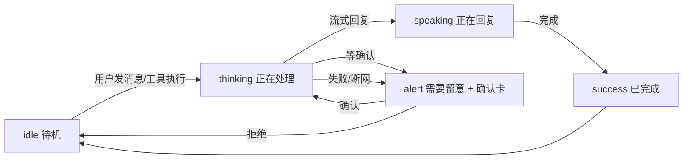

# 10 · Mochi 教师体验设计（「傻瓜式」可执行规格）

> 作者角色：教师体验设计师　|　面向：审核官挑刺 + 最终计划合成
> 事实底座：SKILL.md（人格）/ 01_TOOLCHAIN.md（38 工具）/ 04_REVIEW.md（统一口径 R1–R8）/ 08_DESKTOP_APP_ARCHITECTURE.md（桌面+Orb）
> 硬约束（来自 04 审核报告，违反即否决）：**P0=38 工具、Skill 砍到 4–5 个、Eval 砍到 ~50 条、桌面 APP 不建 Web 版、UI 原样复用 ExpressiveOrb+calm-tokens 不新建设计语言、dsh 锁 Developer Preview 版本**。
> 凡无源码/调研支撑处一律标 `TO_BE_RESOLVED_BY_CODEX`，不编造类名/路径/API。

---

## 0. 一句话定义「傻瓜式」

> **傻瓜式的本质不是"功能少"，而是"决策前移"**：把"要不要写 prompt、选什么模型、调哪个工具、产出什么格式、需不需要确认"这些本该老师做的决定，提前由我们替老师做好；老师只做两件事——**用大白话说要干什么**、**在需要负责任时点一下"行/不行"**。

三个核心机制（贯穿全文）：
1. **预置上下文**：老师是谁、教哪个班、课表、学生名单、职务——开机即知，不问他。
2. **预置工作流**：高频场景做成"一句话触发 + 一键卡片"，不要求老师会拆解任务。
3. **三档自动判断**：只读/写草稿=零确认直接做；发消息/改正式记录/审批=一次确认（写清要做什么）；越权/敏感=不做。老师永远"敢用"，因为可预览、可撤销、可不确认。

---

## 1. 命题一：为什么老师用不好通用 AI 工具

### 1.1 已查证事实（来源：2025 教师 AI 使用调研，53272 份问卷 + 6000 万用户交叉分析）

| 调研结论 | 数据 | 对 Mochi 的含义 |
|---|---|---|
| 教师困于"说不清需求"（prompt 门槛） | **71.4%** | 不能要求写 prompt，必须口语触发 |
| 需要"人工修正 AI 生成内容" | **69.3%** | 产出要经过自检/预览，不能一次交付就完 |
| "缺乏有效教程" | **68.1%** | 界面必须零学习，靠场景卡片引导 |
| 用过 AI 但高频仅 20.3% | 75% 用过 / 高频 20.3% | 留存靠"即拿即用"，不是靠能力堆 |
| 初高中未使用率达 70%，理科教师弃用率高 | 物理/化学教师未使用率 >80% | 通用工具"公式识别弱、知识点错"是硬伤，垂直场景才能赢 |
| "需反复切换工具，缺一站式平台" | 新华网报告原文 | Mochi 把文档/查询/消息/审批合一 |
| "生成内容有偏差，需额外修正" | 新华网报告原文 | 质量循环（CREATE→INSPECT→EDIT）必须内置 |
| 资深教师受"操作复杂、工具切换繁琐"困扰 | 新华网报告原文 | 越资深越怕复杂，UI 必须极简 |

> 来源：[学科网等20家单位《2025年教师人群应用AI调研分析报告》](http://m.jyb.cn/rmtxwwyyq/jyxx1306/202505/t20250508_2111341056.html)、[新华网《2025年中小学教师人群应用人工智能情况调研报告》](https://app.xinhuanet.com/news/article.html?articleId=5538e9f61ad23921dc89bcb4aa9c4791)。数据为真，引用有据。

### 1.2 推断补全（基于常识推理，标注"推断"）

- **推断**：通用工具是"空白对话框"，老师面对空白框不知道能问什么、问了也答非所愿——这比"不会写 prompt"更致命。Mochi 用"场景卡片 + 今日建议"替代空白框。
- **推断**：通用工具不了解校园上下文（"我们班今天谁没回"答不了），因为无校园数据接入。Mochi 经 `jxl.*` 工具接入嘉行联状态。
- **推断**：通用工具产出是"一段文字"，老师要的是"一份能交的 Excel/Word/PPT"。Mochi 默认产出 .docx/.pptx/.xlsx/.pdf，不是 markdown。
- **推断**：通用工具要求选模型/配 API/装插件，老师根本不关心。Mochi 默认 `glm-4-flash`，零配置可用，密钥可选填。

### 1.3 结论（5 条地基，设计据此展开）

1. 老师不该写 prompt → 口语 + 场景卡片触发。
2. 老师不该选模型/配 API → 默认免费档，零配置。
3. 老师不该面对空白框 → 首屏给"今日情境建议 + 场景卡片"。
4. 老师不该自备校园数据 → 开学预置 + 嘉行联同步。
5. 老师要的是"能交的文件" → 默认 Office/PDF 格式 + 自检闭环。

---

## 2. 命题二：「提前配置」预置清单

每条标注预置方式：**配置文件**（写进 `$DSH_HOME` 或本地 JSON）、**首次启动引导**（老师填一次表单）、**从嘉行联同步**（开学导入/运行时拉取）。

### 2.1 预置身份与上下文

| 项 | 内容 | 怎么预置 | 落点 |
|---|---|---|---|
| 老师姓名/工号 | 用于话术自称、署名 | 首次启动引导（1 次表单） | `teacher-profile.json`（本地 JSON，03 §2.3 倾向 JSON） |
| 任教班级 | 高一(1)班等 | 首次启动引导 + **从嘉行联同步**（开学名册） | 同上 |
| 任教学科 | 数学/语文… | 首次启动引导 | 同上 |
| 课表 | 每日节次/地点 | **从嘉行联同步**（教务导出）+ 本地校准 | 同上（驱动"今日建议"） |
| 学生名单 | 姓名/学号/状态 | **从嘉行联同步**（班级名册） | 同上 |
| 职务 | 班主任/任课/年级组长 | 首次启动引导 | 同上（决定默认可见场景） |
| 常用语气偏好 | 给家长/学校/学生口吻 | 预置默认（SKILL.md 已定）+ 可改 | persona |

> 老师**不看到**这个文件，也不进设置深处；首次启动引导是唯一的"配置动作"，填完即忘。

### 2.2 预置工具权限（三档，老师完全无感）

- 预置方式：**配置文件**（`cordis.patch.yml` 的 `permission-presets` + `mochi-approval` 三态表，详见 01 §7 / 03 §3）。
- 默认 preset = `teacher-safe`（sandbox: workspace-write + approval: ask）。老师**没有权限配置界面**。
- 38 个工具分档（以 01 §1.2 / §7.3 为准）：

| 档 | 含义 | 工具 | 老师体验 |
|---|---|---|---|
| **AUTO**（直接做，零确认） | 只读查询/写本地草稿 | `jxl.*`(全只读)、`*.read`/`*.inspect`/`*.search`、`spreadsheet.create/write/formula`、`doc.create/edit`、`ppt.create/edit/...`、`file.search/read/create_folder`、`calendar.*`、`task.*`、`reminder.*`、`message.draft` | 不弹卡 |
| **CONFIRM**（一次确认） | 有对外/不可逆副作用 | `message.send`、`file.rename/copy/move`、`pdf.merge` | 弹确认卡，写清"我要做什么" |
| **DENY**（不做） | 越权/敏感 | 学生自批自己申请、删正式记录、跨隐私透传 | 不弹卡，LLM 自然解释"看不了/不能" |

- 模型默认档：**配置文件**（`settings.yaml`：`glm-4-flash` 默认；`glm-4.7-flash` 仅限流兜底，老师**不换模型**）。
- 升级策略：仅当 `glm-4-flash` 返回 429/限流时，客户端自动切 `glm-4.7-flash` 重试该 turn（03 §5.2）。**老师无感知、无开关**。

### 2.3 预置工作流（场景卡片 / 一键触发）

- 预置方式：**配置文件**（4–5 个 Teacher Skill，见 §4 / 03 §4.2 已砍到 4–5 个）。
- 高频场景做成"一句话触发 + 一键卡片"（见 §4 场景库）。Skill 是 Agent 的方法体，不是关键词→固定回答（03 §1.1 红线）。

### 2.4 预置话术与语气

- 预置方式：**配置文件**（SKILL.md + persona，已定）。
- 三套口吻由场景自动选：给家长（温和、通知式）、给学校（公文、规范）、给学生（简明、鼓励）。**老师不切换**，Mochi 按接收方自动定调。

### 2.5 预置输出格式

- 预置方式：**配置文件**（工具默认 `outputName` + Skill 默认产出类型）。
- 默认产出 `.docx` / `.pptx` / `.xlsx` / `.pdf`，**绝不默认 markdown**。文件落 `workspaceRoot`（01 §2.3，`~/.mochi/workspace` 或 `MOCHI_WORKSPACE`），并登记 Artifact 版本链（01 §5）。

### 2.6 预置清单规模（直接结论）

- 身份上下文：**6 类字段**，1 次引导 + 嘉行联同步。
- 工具权限：**38 工具分 3 档**，0 个老师可见配置项。
- 模型：**1 默认 + 1 兜底**，0 开关。
- 工作流：**4–5 个 Skill**（对应 §4 场景库）。
- 话术/格式：**3 口吻 + 4 文件格式**，全预置。
- **总规模可控，26 天内可完成。**

---

## 3. 命题三：「AI 智能判断后就可以直接用了」怎么落地

### 3.1 AI 怎么判断"老师现在想干什么"

判断信号（按优先级，全部来自预置上下文，不要求老师说明）：

| 信号 | 来源 | 例子 |
|---|---|---|
| 时间上下文 | 系统时钟 + 课表 | 周一 7:50 → 推"晨检"；期末周 → 推"成绩分析"；开学 → 推"分班/名册" |
| 职务上下文 | `teacher-profile.json` | 班主任 → 默认显示"班级周报/家长通知"卡片 |
| 关键词/口语 | LLM 意图识别 | "谁没到"→晨检；"做个 PPT"→课件；"跟王老师换课"→协调 |
| 近期 artifact | Episodic 索引（P1，03 §2.4） | "还是上次那样"→复用上次格式 |

> 时间/职务信号驱动**首屏"今日情境建议"**（见 §6），不弹窗、不追问。

### 3.2 判断错了怎么办——必须能撤销，且不能默默做错

- **只读/草稿类**：判断错无副作用，老师直接重说即可。
- **CONFIRM 类（发消息/改记录）**：判断错 → 老师在确认卡点"拒绝"即中止；**已发出**的消息撤销能力 `TO_BE_RESOLVED_BY_CODEX`（取决于嘉行联是否支持撤回 API，v1 先做"发送前预览 + 拒绝"兜底）。
- **文件类产出**：判断错 → Artifact **版本链 copy-on-write**（01 §5.2），每次 `edit` 写新版本不覆盖旧版，**可回滚**；Mochi 主动说"我改了第 3 页，要还原点这里"。
- **绝不默默做错**：凡 CONFIRM 工具，reason 必须写清"我要做什么"（SKILL.md 分档）；凡产出文件，先预览再"交付"，不静默落盘即结束。

### 3.3 「直接用了」= 不要确认？还是一次确认？——决策

**决策：分三档，不是"全不要确认"，也不是"全要确认"。**

| 操作类型 | 确认策略 | 理由 |
|---|---|---|
| 只读查询（查状态/查学生） | **零确认，直接做** | 无副作用，老师要的是"快答" |
| 写本地草稿/生成文件（不发） | **零确认，直接做** | 文件在 workspace，可逆、可改、不出校 |
| 发消息/改正式记录/审批/共享 | **一次确认**（写清"我要做什么"） | 有对外/不可逆副作用，必须人在环 |
| 越权/敏感/替人拍板 | **不做**（DENY） | 红线，见 SKILL.md §5 |

**理由**：
1. dsh approval 机制**只支持 `allowed-once`（一次性授权），没有 `allow-always`**（01 §0.3 已核实）——所以"一次确认"是机制本来就给的，不是我们加的。
2. 老师"敢用"的前提是**可逆 + 可预览 + 可拒绝**；对无副作用操作零确认=快，对有副作用操作一次确认=稳。两头都照顾，才叫傻瓜式。
3. 绝不对 CONFIRM 操作"静默直接做"——那会摧毁信任，违背 SKILL.md「出错了就说明情况」。

### 3.4 怎么让老师敢用

- **可预览**：CONFIRM 前给"将要发出/将要改"的预览（消息全文、文件摘要）。
- **可撤销**：Artifact 版本链回滚；确认卡可拒。
- **低成本出错**：只读/草稿零风险；真正有风险的操作都有人确认。
- **透明**：球的状态（§6.2）+ 步骤卡让老师"看见 Mochi 在干什么"，不黑箱。

---

## 4. 命题四：校园场景库（教师端 + 学生端）

> 设计边界（来自 04 审核 R2/R7 + 01 §1.2）：**v1 单机模拟、不建真实 A2A 服务器；38 工具封顶；4–5 Skill**。场景库覆盖用户建议的 10 类，每类一行。权限级别 = AUTO / CONFIRM / DENY（对应 §3.3）。
> "工具链"列只写 01 已定义的真实工具名（04 P0-2 要求：Skill 工具名必须与 01 对齐，禁止 `doc.write`/`user-questions` 等不存在名）。

| # | 场景 | 老师/学生原话 | Mochi 行为 | 工具链（01 真实名） | 产出 | 权限 |
|---|---|---|---|---|---|---|
| 1 | 晨检与考勤 | "今天谁没到/谁请假了" | 拉实时状态+课表，聚合成晨检简报 | `jxl.student_query`(status/onlyOverdue) + `calendar.search` + `spreadsheet.create` | 晨检表.xlsx + 口头 3 行简报 | AUTO |
| 2 | 学生外出/就医 | "张明远去医务室了还没回" | 查 clinic 状态；超时则提醒并起草跟进 | `jxl.clinic_status` / `jxl.student_query` → 超时 `reminder.create` + `message.draft` | 状态播报 + 超时提醒；需通知则 CONFIRM | AUTO读 / CONFIRM通知 |
| 3 | 成绩分析 | "把这次月考做个分析" | 读 Excel→算均分/及格率/波动→出图→生成家长会 PPT（含自检循环） | `spreadsheet.read`→`spreadsheet.formula`→`ppt.create`→`ppt.inspect`→`ppt.edit_slide`→`ppt.export` | 家长会.pptx | AUTO（写本地） |
| 4 | 教案与课件 | "帮我备一下《XXX》" | 按学科/学段起草大纲→生成教案/课件 | `doc.create` / `ppt.create`（+`ppt.inspect`自检） | 教案.docx / 课件.pptx | AUTO |
| 5 | 班级周报/月报 | "生成本周班级周报" | 聚合一周状态+事件→模板生成 | `jxl.*` + `calendar.search` + `doc.create`/`doc.edit` | 周报.docx | AUTO |
| 6 | 家长沟通 | "给家长发个周末安全提醒" | 起草通知→预览→确认后发 | `message.draft` → `message.send` | 通知草稿→已发 | CONFIRM |
| 7 | 同事协调 | "周五第三节跟王老师换课" | 查双方空闲→起草换课请求→确认后发 | `calendar.search` + `message.draft` → `message.send` | 换课请求（待确认发出） | CONFIRM |
| 8 | 行政填表 | "把这个表填一下" | 读模板→按上下文填→自检→导出 | `doc.read`→`doc.edit`/`doc.create`→`doc.export` | 填好的.docx | AUTO（写本地） |
| 9 | 学生端：请假/报修/问讯 | 学生："我要请假"/"教室灯坏了" | 生成规范草稿→提交老师审批（scope 隔离，不替批） | `doc.create`(请假条) → `message.draft`(提交) | 请假条.docx / 报修单 | CONFIRM提交（学生不自批） |
| 10 | 医务室/宿舍异常 | "宿舍有人发烧" | 查 dorm/clinic→起草异常上报→确认通知班主任/校医 | `jxl.dorm_status`/`jxl.clinic_status` + `message.draft`→`message.send` | 异常上报记录 + 通知 | AUTO读 / CONFIRM通知 |

**场景库最终定 10 个**（覆盖用户建议的 10 类，未增删多余场景）。每个场景的工具链严格来自 01 的 38 工具，无虚构。

### 4.1 关键 UX 约束（来自 dsh approval 限制）

> **已核实**：dsh 审批 payload **不带工具参数**，answerer 只看到「工具名 + reason + callId」（01 §0.3）。
> **设计后果**：CONFIRM 类工具在 `execute` 内**必须把关键参数写进 reason 文本**（如"我要给王老师发换课请求：周五第三节，你高一(1)班数学换他的自习"），因为确认卡上看不到参数。这是 01 §7.3 已要求的"reason 写清要做什么"的硬落地——**所有 CONFIRM 工具的 reason 必须由 args 现场拼装，禁止写死**。

---

## 5. 命题五：效果比同类工具「更好」，好在哪（诚实对比）

| 维度 | 通用 AI 工具（WorkBuddy/ChatGPT 等） | Mochi |
|---|---|---|
| 上手成本 | 需注册、选模型、学 prompt | **零配置**：默认免费档，首启填 1 次表单 |
| 需要写 prompt | 是（71.4% 教师困于此） | **否**：口语 + 场景卡片触发 |
| 校园上下文 | 无（答不了"我们班谁没回"） | **有**：`jxl.*` 接入嘉行联实时状态 |
| 产出形态 | 一段文字 / markdown | **能交的文件**：.docx/.pptx/.xlsx/.pdf + 自检闭环 |
| 高频场景 | 自己拆解任务 | **一键场景**：晨检/成绩分析/换课预置 |
| 确认机制 | 发消息/改文件常无确认或全确认 | **三档**：无副作用零确认，有副作用一次确认 |
| 计算/写作绝对能力 | **更强**（背后大模型更大） | 弱于付费大模型，靠 Skill 方法体补 |
| 内容专业度（理科公式/知识点） | **常错**（调研：理科教师弃用率>80%） | 垂直场景 + 工具取数，**偏差更小** |
| 一站式 | 多工具切换 | 文档+查询+消息+审批合一 |
| 隐私/数据不出校 | 取决于厂商 | **关遥测 + 本地优先**（08 §6.4） |

**最有杀伤力的一行（评委视角）**：
> 通用工具赢在"模型本身更强"，Mochi 赢在"老师不用学就会用、说人话就能办成、产出直接能交"——**这是 71.4% 困于 prompt、69.3% 要返工的教师真正缺的，不是更强的模型**。

**诚实声明**：Mochi 不声称在裸计算/写作能力上超过 ChatGPT；它的优势是**场景贴合度 + 交付完整度 + 零门槛**，建立在免费 `glm-4-flash` 之上。吹"什么都更强"会被评委一眼看穿（04 审核报告已警告）。

---

## 6. 命题六：UI 上的「傻瓜式」怎么体现

### 6.1 硬约束复核（来自 04 R7 + 用户红线）

- 球 = `ExpressiveOrb`，**原样复用**，不改渲染逻辑（已读源码，03 §7.5 / 08 §4.1）。
- 桌面 APP（Electron 39 + WebView），**不是网站**（04 P0-6 砍 Web 版）。
- 视觉红线：无塑料感（焦糖球）、无横向滚动条（`overflow-x:hidden`）、有字处加圆角矩形、颜色跨度小（复用 `calm-tokens.css` 深绿画布 #45584e + 焦糖/琥珀系）。

### 6.2 主界面结构（避免空白对话框）

**结论**：主界面 = **球（常驻顶部/中央）+ 今日情境建议卡片 + 场景快捷卡片 + 输入框**。空白对话框是老师最大敌人，用"预置卡片"替代。

```
┌─────────────────────────────────────────────┐
│         [ExpressiveOrb 球]  待机              │  ← 球常驻，状态见 6.2
│  早上好，李老师。今天高一(1)班 1-2 节数学。   │  ← 情境化问候（来自课表）
│                                               │
│  ┌──────────┐ ┌──────────┐ ┌──────────┐      │
│  │ 今日晨检 │ │ 成绩分析 │ │ 家长通知 │  …    │  ← 今日情境建议卡片（时间/职务驱动）
│  └──────────┘ └──────────┘ └──────────┘      │
│  ┌──────────┐ ┌──────────┐ ┌──────────┐      │
│  │ 换课协调 │ │ 班级周报 │ │ 填表助手 │  …    │  ← 场景快捷卡片（点即触发，不写 prompt）
│  └──────────┘ └──────────┘ └──────────┘      │
│                                               │
│  ┌─────────────────────────────────────────┐ │
│  │ 直接说，比如"谁今天没到"  [_input_][发送] │ │  ← 圆角输入框 + 占位提示
│  └─────────────────────────────────────────┘ │
└─────────────────────────────────────────────┘
```

- 首屏**不空白**：上方情境问候 + 中部"今日建议"卡（基于时间/职务）+ 下部常驻场景卡。老师点卡或打字都行。
- 占位提示给例句（"谁今天没到"），降低"不知道问什么"的门槛（对应 71.4% 痛点）。

### 6.3 球的状态（以实际代码为准，已读 ExpressiveOrb.tsx）

**源码真实状态（L37-43）**：
```ts
type ExpressiveOrbMood = "idle" | "thinking" | "listening" | "speaking" | "success" | "alert";
```
`MOOD_LABEL`（L57-64）：idle=待机 / thinking=正在处理 / listening=正在聆听 / speaking=正在回复 / success=已完成 / alert=需要留意。

**重要纠正（用户命题的误读）**：球**没有**独立的"需要你确认"态，也**没有**独立的"出错了"态。这两类在源码里都归到 `alert`（需要留意）。因此：
- "需要你确认" → 球变 `alert` + 屏幕弹**确认卡**（卡是独立 UI，不是球态）。
- "出错了" → 球变 `alert` + 文字说明情况（SKILL.md §6 要求：说明失败+下一步）。
- `listening`（正在聆听）首版**不接麦克风**，保留不用（08 §4.2 已定）。

**dsh 运行时事件 → 球态映射（与 08 §4.3 一致）**：

| dsh 事件 / 状态 | 球 mood | 说明 |
|---|---|---|
| 初始化/握手 | thinking | 等 initialize |
| turn 进行中、工具执行、模型推理 | thinking | 暗茶褐、呼吸快 |
| 收到 assistant/message 流式文本 | speaking | 亮琥珀、开口 |
| 等人工审批（approval/request→CONFIRM） | alert | 赭棕示警 + 弹确认卡 |
| 任务完成 | success → idle | 先蜜金再回落 |
| 崩溃/限流/网络断 | alert | 提示后转演示模式或重连 |



### 6.4 过程可见性 vs 简洁

- **步骤卡**：CONFIRM/多工具任务时，下方展开"步骤卡"（如「①查月考.xlsx → ②算均分 → ③生成 PPT」），让老师看见 Mochi 在干什么（对应"过程可见性"）。
- **不啰嗦**：纯聊天/只读查询不展开步骤卡，球直接答。
- 任务态用 04 R6 的 **6 态**（PENDING_SEND / RUNNING / INPUT_REQUIRED / APPROVAL_REQUIRED / COMPLETED / TERMINATED），前端文案区分，不与球态混用。

### 6.5 老师怎么拿到产出

- 文件落 `workspaceRoot`（01 §2.3），并登记 Artifact（01 §5）。
- 对话流内以**圆角 Artifact 卡**呈现：显示文件名 + 类型图标 +「打开 / 预览 / 导出」按钮。
- 「打开」调用系统关联程序（Mac `open` / Win `start`）打开真实 .docx/.pptx；「预览」走结构化概览（01 §5.5，P0 不做像素预览，`TO_BE_RESOLVED_BY_CODEX`：目标机是否预装 `soffice`）。
- 「导出」复制到老师指定路径（如桌面），返回导出路径。

---

## 7. 与已有文档的接口（不重复造轮子）

| 本文件结论 | 落到哪份文档 | 动作 |
|---|---|---|
| 预置三档权限 | 01 §7 + 03 §3 | `mochi-approval` 三态表已定义，本文件确认"老师无权限界面" |
| 场景库 10 个 | 03 §4.2（Skill 砍 4–5） | Skill 工具名**必须**用 01 真实名（04 P0-2） |
| 球 6 态映射 | 08 §4.2/§4.3 | 已一致，本文件纠正"无独立确认/错误态" |
| 确认卡 reason 拼装 | 01 §7.3 / §8.7 | CONFIRM 工具 execute 内由 args 拼 reason（硬要求） |
| 首屏卡片/今日建议 | 08 §7（前端） | 新增"场景卡 + 今日建议"布局，不新建设计语言（R7） |
| 产出获取 | 01 §5（Artifact） | Artifact 卡 + 打开/预览/导出 |

---

## 8. 风险与未决项（诚实）

| 项 | 风险 | 处置 |
|---|---|---|
| 球无独立"确认/错误"态 | 中 | 已用 `alert` 兜底 + 独立确认卡补足；文档已纠正误读 |
| 审批 reason 不含参数 | 中 | CONFIRM 工具由 args 拼 reason（06.4.1），需编码落实 |
| 学生端 scope 隔离 | 中 | 03 §2 用 dsh scope；v1 仅 Student 视角演示级（04 砍多节点） |
| 已发消息撤回 | 中 | `TO_BE_RESOLVED_BY_CODEX`：嘉行联是否支持撤回；v1 靠"发送前预览+拒绝" |
| 像素预览（soffice） | 中 | `TO_BE_RESOLVED_BY_CODEX`：P0 用结构化概览 |
| 今日建议的课表信号 | 低 | 依赖嘉行联同步课表；演示用 fixture（04 P1-8） |
| dsh Developer Preview 变动 | 中 | 锁版本 + 演示模式兜底（08 §7.3） |

---

> 文档完。所有结论锚定 01/03/04/08 已核实事实 + ExpressiveOrb 真实源码 + 2025 教师调研数据；凡无法核实者标 `TO_BE_RESOLVED_BY_CODEX`，未编造状态/类名/API。
